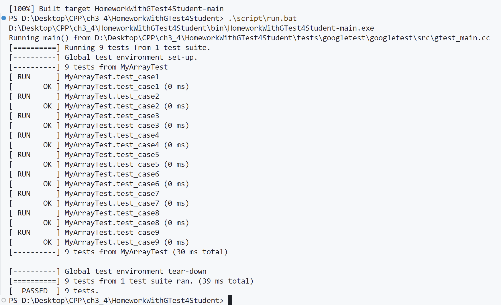

# 第三章作业
## 第1题
``` cpp
float g(int i ) {} 
int g(int j) {}    
// 编译报错，仅修改函数返回类型无法重载函数
```

## 第2题
``` cpp
int f(int x) {}
int f(int x, int y = 0) {}
int f(int x, ...) {}
int test2() { f(1,2,3); }
// 编译通过，f(1,2,3)会调用f(int x, ...)
```

## 第3题
``` cpp
int f(int x) {}
int f(int x, int y = 0) {}
int f(int x, ...) {}
int test2() { f(1); }
// 编译报错，f(1)与三个函数都可以匹配，产生二义性
```

## 第4题
``` cpp
int get(int *p, int index) {
    return p[index];
}
void test4() {
    int a[10];
    for (int i = 0; i < 10; i++) {
        get(a, i) = i;
    }
}
// 不能正常运行，get函数返回的是一个右值
// 修改如下：
int& get(int *p, int index) {
    return p[index];
}
```

## 第5题
``` cpp
void f(int* p) { 
    std::cout << "void f(int * p)" << std::endl; 
}
void f(const int *p) { 
    std::cout << "void f(const int * p)" << std::endl; 
}
void test5() {
    int a[2] = {1,2};
    const int b[2] = { 1,2 };
    f(a);   
    f(b);   
}
// f(a)调用void f(int* p)
// f(b)调用void f(const int* p)
```

## 第6题
``` cpp
void print(const char* p) {}
void print(int i) {}
void test6() {
    void print(int);
    print("Hello");
}
// 编译报错，test6中定义了一个局部函数void print(int i)，它会隐藏外部的同名函数，
// 因此print("Hello")会调用该局部函数，而这个函数需要接受一个int类型的参数
```

# 第四章作业
## 第1题
``` cpp
class A {
public:
    int i;
}a1;
void test1() {
    static A a2;
    std::cout << "a1.i = " << a1.i  << std::endl;
    std::cout << "a2.i = " << a2.i  << std::endl;   
}
// a1.i=0，全局对象的基本类型成员会被自动初始化为0
// a2.i=0，静态局部对象的基本类型成员也会被自动初始化为0
// 如果在test1里定义A a3，不能打印出a3.i，编译报错:使用了未初始化的局部变量
```

## 第2题
``` cpp
class A {
    int x;
public:
    A(int x):x(x) {}
}; 
A a;        //语句1
A b(1);     //语句2
// 语句1编译报错，创建A类对象a时需要给构造函数传递参数来初始化成员x
// 语句2编译通过，调用A(int x)给成员x赋值
```

## 第3题
``` cpp
// 给定A类的定义
// 请为class B添加合适的构造函数，使得下面的语句能够编译通过
class A {
    int x;
public:
    A(int x):x(x) {}
};
class B {
    const A a;
    const A& ra;
} b;

// 添加如下：
class B {
    const A a;
    const A& ra;
public:
    // 构造函数，接受一个参数并初始化 a 和 ra
    B(int x):a(x),ra(a) {}
} b;
```

## 第4题
``` cpp
// 给定下面类的定义
class A {
    int x;
public:
    A(int x) :x(x) {}
};
class B {
    const int i = 0;
};
class E {
    A a;
    B b;
//则下面class E的构造函数哪些是正确的,哪些是错误的？请说明原因
public:
    E():a(1){}          //构造函数1
    E():b(){}           //构造函数2
    E():a(1),b() {}     //构造函数3
};

// 构造函数1正确：a(1)正确地初始化了A类的成员a，B的成员b是默认构造的
// 构造函数2错误：A类中自己写了带参的构造函数，因此编译器不会提供默认构造函数，
//               b()相当于显式调用B类的默认构造函数
// 构造函数3正确
```

## 第5题
``` cpp
class A {
    A() {}
} a;
//编译错误，无法调用私有构造函数
class B {
    int i;
    int j;
public:
    explicit B(int x, int y = 0) :i(x), j(y) {}
};
B b1;
B b2 = 1;
// B b1  ：译器无法使用默认构造函数来初始化b1
// B b2=1：构造函数B(int x, int y = 0)是一个显式构造函数(explicit)，
//         这意味着它不能隐式转换其他类型（在这里是 int）为B类型
```

## 第6题
### `HomeworkWithGTest4Student`
### MyArrayTest中的测试函数均通过
<div align = left>

</div>