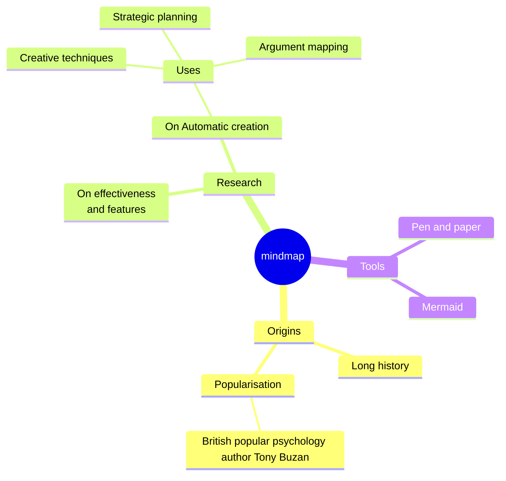

  
  <h2 align="center">🏫 <i>School of Computer Science&Technology, HUST</i> 🏫</h2>
  
🏆 <i>Course archive: notes, code, lab reports, courseware, etc</i> 🏆

❤️ <i>If you have any questions, please ask ChatGPT</i> ❤️

  

<!-- 

<h2 align="center">⭐ <i>Star History</i> ⭐</h2>
  

 -->

<h2 align="center">⭐ <i>Star History</i> ⭐</h2>
  

<h2 align="center">⚡️ <i>Stay Awesome</i> ⚡️</h2>
   

 

<!--

  <a href="https://img.shields.io">
  

-->

<!--

-->

