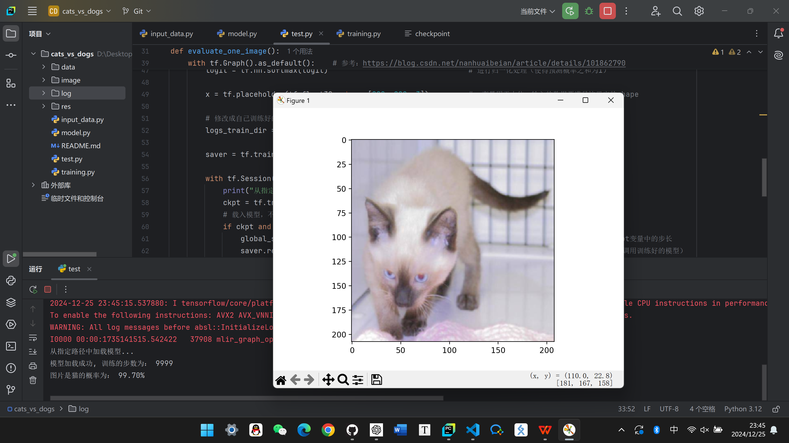

# 基于CNN的猫狗识别系统

这是一个基于卷积神经网络（CNN）实现的猫狗分类系统。通过深度学习，模型能够识别图像中的猫或狗，输出其类别及概率。该项目主要分为数据预处理、模型构建、训练和评估四个部分。

## 目录结构

```
cats_vs_dogs/
├── data/                 
│   ├── train/
│   │   ├── cat.1.jpg
│   │   ├── dog.1.jpg
│   │   ├── ...
│   └── test/
│       ├── 1.jpg
│       ├── 2.jpg
│       └── ...
│
├── image/             # 训练图&结果图
├── log/               # 训练模型和参数(学习率0.0001)
├── res/               # 存放classify.py分类结果
│
├── input_data.py      # 数据预处理，加载图片及标签
├── model.py           # 定义CNN神经网络模型
├── training.py        # 模型训练和保存
├── test.py            # 模型测试与预测
├── classify.py        # 预测200张图片并分类
│
└── README.md          # 项目说明文档
```

## 环境要求

- Python 3.12.2
- TensorFlow 2.18.0 (使用 `tensorflow.compat.v1` 模式)
- NumPy
- Matplotlib
- Pillow

## 安装依赖

可以使用 `pip` 安装项目所需的依赖包：

```bash
pip install tensorflow==1.15 numpy matplotlib pillow
```

## 使用方法

### 1. 数据准备

需要准备一个猫狗数据集，该数据集应包含猫和狗的图片。

```
data/
├── train/
│   ├── cat.1.jpg
│   ├── dog.1.jpg
│   ├── ...
└── test/
    ├── 1.jpg
    ├── 2.jpg
    └── ...
```

其中，`train/` 文件夹包含猫狗图片，`test/` 文件夹用于存放测试图片。标签由文件夹的名称确定（`train/cat` 表示猫，`train/dog` 表示狗）。

### 2. 数据预处理

在 `input_data.py` 文件中，`get_files` 函数会读取指定目录下的图片文件并生成标签。`get_batch` 函数则会对图片进行批量处理、缩放和标准化操作。

### 3. 训练模型

训练模型使用 `training.py` 文件。执行此脚本时，模型将根据准备好的数据进行训练，并保存模型参数。

可以修改以下训练参数：

```python
BATCH_SIZE = 16  # 每批次读取数据的数量
CAPACITY = 2000  # 队列最大容量
MAX_STEP = 10000  # 训练最大步数，一般5K~10k
learning_rate = 0.0001  # 学习率，一般小于0.0001
```

执行训练脚本：

```bash
python training.py
```

训练过程中每隔50步打印一次当前的loss以及acc。每100步记录数据并描点作图。每5000步会保存一次训练好的模型，最终保存的模型将用于测试和预测。训练结束将打印训练图。

### 4. 测试与预测

训练完成后，可以使用 `test.py` 对新图片进行分类预测。该脚本会随机从测试集目录中选择一张图片，并使用训练好的模型进行分类预测，输出图像属于猫或狗的概率。

执行测试脚本：

```bash
python test.py
```

此脚本会显示选取的测试图片，并打印出该图片是猫还是狗的预测结果以及对应的概率。

### 5. 项目中主要函数的作用

- **`input_data.py`**：
  
  - `get_files`: 获取训练集中的图像文件路径及对应标签。
  - `get_batch`: 批量加载和处理图像，进行图像的缩放和标准化。

- **`model.py`**：
  
  - `cnn_inference`: 定义卷积神经网络的结构，包含卷积层、池化层、全连接层。
  - `losses`: 计算损失函数（交叉熵）。
  - `training`: 定义训练操作，使用 Adam 优化器来最小化损失。
  - `evaluation`: 计算模型的准确率。

- **`training.py`**：
  
  - 负责模型训练，包括获取数据批次、计算损失、更新模型参数和保存模型。
  - ，每100步记录训每50步打印一次当前损失和准确率练过程中的准确率和损失值，每5000步保存一次训练模型。

- **`test.py`**：
  
  - 加载训练好的模型，并对随机选取的一张图片进行猫狗分类预测。
  - 显示预测结果以及对应的概率。

## 项目输出

- 在训练过程中，模型的损失和准确率会显示在控制台，并且每5000步保存一次模型。
- `test.py` 会输出一张测试图片以及该图片是猫还是狗的预测结果。

## 注意事项

- 确保数据集路径正确，并且训练集和测试集的图像格式一致。
- 该项目使用 TensorFlow 1.x，如果你使用的是 TensorFlow 2.x，确保启用了兼容模式：`import tensorflow.compat.v1 as tf` 并调用 `tf.disable_v2_behavior()`。

## 训练图（准确率与损失值）

  

## 预测结果图


