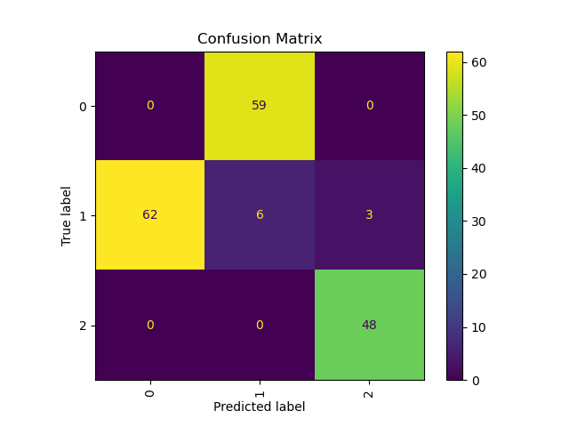
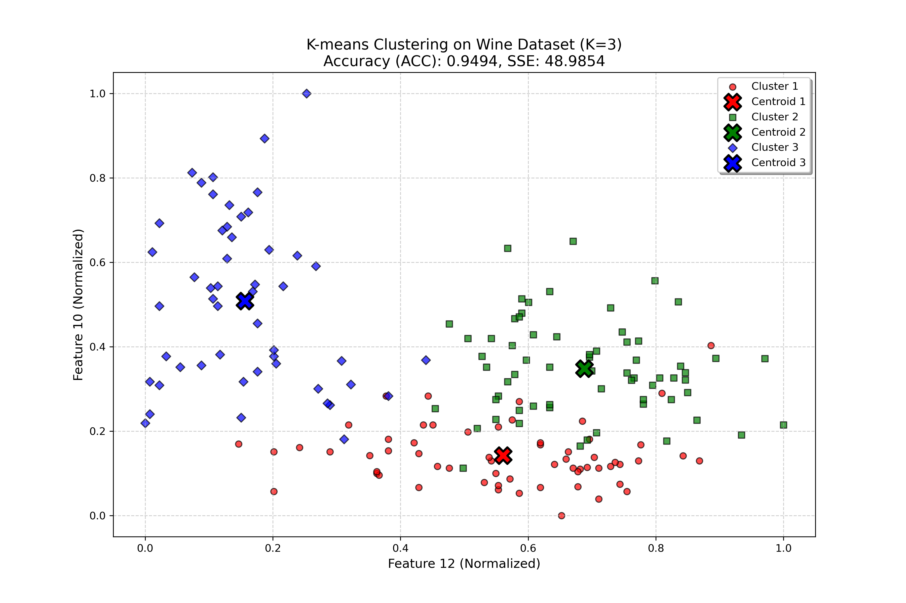

# K-means 聚类算法实现

## 项目简介
本项目实现了基于 K-means 算法的聚类分析，适用于对多维数据进行无监督学习。项目包含以下功能：
- 使用 K-means 算法对数据进行聚类。
- 计算聚类的准确率（ACC）。
- 计算误差平方和（SSE）。
- 可视化聚类结果。
- 保存混淆矩阵和聚类结果图像。

---

## 文件结构
```
.
├── data/
│   └── normalizedwinedata.csv   # 输入数据文件
├── output/
│   ├── confusion_matrix.png     # 混淆矩阵图像
│   └── kmeans.png               # 聚类结果图像
├── code/
│   └── kmeans.py                # 主代码文件
└── README.md                    # 项目说明文档
```

---

## 环境依赖
运行本项目需要以下依赖：
- Python 3.7+
- NumPy
- Matplotlib
- SciPy
- scikit-learn

安装依赖：
```bash
pip install numpy matplotlib scipy scikit-learn
```

---

## 数据说明
输入数据文件为 `normalizedwinedata.csv`，格式如下：
- 第一列为样本的真实标签（从 1 开始）。
- 后续列为样本的特征数据。

---

## 使用方法
1. 将输入数据文件放置在 `data/` 目录下。
2. 运行 `kmeans.py` 文件：
   ```bash
   python kmeans.py
   ```
3. 输出结果：
   - 在控制台打印聚类准确率（ACC）和误差平方和（SSE）。
   - 在 `output/` 目录下生成以下文件：
     - `confusion_matrix.png`：混淆矩阵图像。
     - `kmeans.png`：聚类结果的可视化图像。

---

## 代码功能说明
### 主函数
```python
if __name__ == "__main__":
```
- 加载数据并提取特征和标签。
- 调用 `kmeans` 函数进行聚类。
- 计算聚类准确率（ACC）和误差平方和（SSE）。
- 可视化聚类结果并保存图像。

### K-means 算法
```python
def kmeans(X, k=3, max_iter=100)
```
- 输入：数据矩阵 `X`，聚类数 `k`，最大迭代次数 `max_iter`。
- 输出：每个样本的聚类标签 `labels` 和聚类中心 `centroids`。

### 准确率计算
```python
def calculate_acc(y_true, y_pred)
```
- 使用混淆矩阵和匈牙利算法计算聚类准确率。

---

## 输出示例
运行程序后，控制台输出如下：
```
Accuracy (ACC): 0.8421
Sum of Squared Errors (SSE): 123.4567
```

生成的图像文件：
1. **混淆矩阵**：
   

2. **聚类结果**：
   

---

## 注意事项
1. 输入数据需要经过归一化处理，以确保特征值的范围一致。
2. 如果某个聚类为空，程序会随机选择一个样本作为新的聚类中心。
3. 聚类结果的准确率依赖于初始聚类中心的选择，可能会有一定波动。

---

## 参考
- [K-means 算法](https://en.wikipedia.org/wiki/K-means_clustering)
- [scikit-learn 文档](https://scikit-learn.org/stable/)
