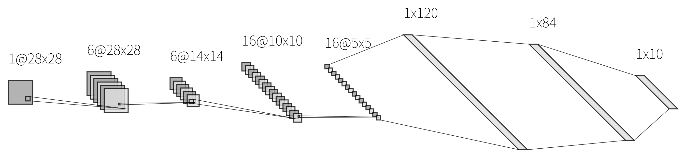
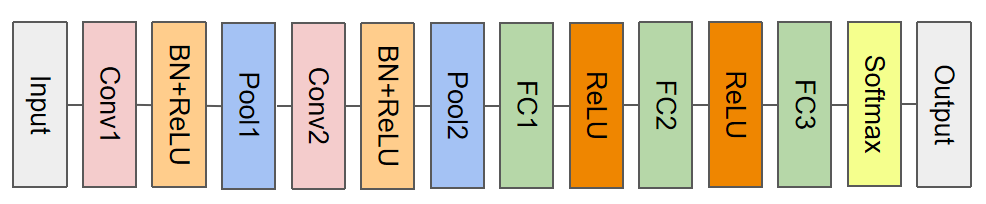

## 项目结构
```
Fashion-MNIST-Chiale/
├── README.md          
├── cnn-by-myself/     # 手动实现的CNN模型
│   ├── cnn_model.py     # CNN模型定义
│   ├── data_loader.py   # 数据加载和预处理
│   ├── demo.ipynb       # 演示代码
│   ├── plot.py          # 可视化工具
│   ├── predict.py       # 模型预测脚本
│   ├── README.md        # 子模块说明文档
│   ├── train.py         # 模型训练脚本
│   ├── img/             # 可视化图片
│   │   ├── 1.png        # 示例图片
│   │   ├── 1.svg        # 示例矢量图
│   │   ├── ...          # 更多图片
│   ├── logs/            # 训练日志
│   ├── models/          # 保存的模型文件
├── cnn-by-pytorch/    # 基于PyTorch实现的CNN模型
│   ├── cnn_model.py     # CNN模型定义
│   ├── data_loader.py   # 数据加载和预处理
│   ├── demo.ipynb       # 演示代码
│   ├── plot.py          # 可视化工具
│   ├── predict.py       # 模型预测脚本
│   ├── README.md        # 子模块说明文档
│   ├── train.py         # 模型训练脚本
│   ├── img/             # 可视化图片
│   │   ├── 1.png        # 示例图片
│   │   ├── 1.svg        # 示例矢量图
│   │   ├── ...          # 更多图片
│   ├── logs/            # 训练日志
│   ├── models/          # 保存的模型文件
├── data/              # 数据集目录
│   ├── t10k-images-idx3-ubyte.gz  # 测试集图像
│   ├── t10k-labels-idx1-ubyte.gz  # 测试集标签
│   ├── train-images-idx3-ubyte.gz # 训练集图像
│   ├── train-labels-idx1-ubyte.gz # 训练集标签
```


## *[cnn-by-myself](./cnn-by-myself/demo.ipynb)*
> 仿照LeNet

### *模型定义*
```
Layer (type)         Output Shape         Param #
==================================================
Conv2D               (6, 28, 28)          156
BatchNorm            (6, 28, 28)          12
ReLU                 (6, 28, 28)          0
MaxPool2D            (6, 14, 14)          0
Conv2D               (16, 10, 10)         2416
BatchNorm            (16, 10, 10)         32
ReLU                 (16, 10, 10)         0
MaxPool2D            (16, 5, 5)           0
FullyConnected       (120,)               48120
ReLU                 (120,)               0
FullyConnected       (84,)                10164
ReLU                 (84,)                0
FullyConnected       (10,)                850
==================================================
Total params: 61750
```



### *超参数*
|   *Parameter*   | *Value*  |
| :-------------: | :------: |
|   *max_steps*   |  *5000*  |
|  *batch_size*   |   *64*   |
| *learning_rate* | *0.0005* |

### *损失&准确率*
| *1000 Steps*     | *5000 Steps*     |
|:----------------:|:----------------:|
|  |  |

### *测试结果*
```
model                   accuracy
================================
model_step1000.npz       0.8016
model_step2000.npz       0.8264
model_step3000.npz       0.8462
model_step4000.npz       0.8534
model_step5000.npz       0.8612
```

### *混淆矩阵*


## *[cnn-by-pytorch](./cnn-by-pytorch/demo.ipynb)*
>基于pytorch

### *模型定义*
```
Param                Shape                Num #     
==================================================
conv1.weight         (32, 1, 3, 3)        288       
conv1.bias           (32,)                32        
bn1.weight           (32,)                32        
bn1.bias             (32,)                32        
conv2.weight         (64, 32, 3, 3)       18432     
conv2.bias           (64,)                64        
bn2.weight           (64,)                64        
bn2.bias             (64,)                64        
fc1.weight           (512, 3136)          1605632   
fc1.bias             (512,)               512       
fc2.weight           (10, 512)            5120      
fc2.bias             (10,)                10        
==================================================
Total params: 1630282
```
 

### *超参数*
|   *Parameter*   | *Value* |
| :-------------: | :-----: |
|    *epochs*     |  *20*   |
|  *batch_size*   |  *128*  |
| *learning_rate* | *0.001* |

### *损失&准确率*
 


### *测试结果*
```
+-------+---------------+
| Epoch | Test Accuracy |
+-------+---------------+
|   1   |     0.8797    |
|   2   |     0.8907    |
|   3   |     0.9011    |
|   4   |     0.9083    |
|   5   |     0.9161    |
|   6   |     0.9136    |
|   7   |     0.9232    |
|   8   |     0.9252    |
|   9   |     0.9255    |
|   10  |     0.9258    |
|   11  |     0.9299    |
|   12  |     0.9248    |
|   13  |     0.9300    |
|   14  |     0.9257    |
|   15  |     0.9243    |
|   16  |     0.9257    |
|   17  |     0.9266    |
|   18  |     0.9289    |
|   19  |     0.9271    |
|   20  |     0.9264    |
+-------+---------------+
```

### *混淆矩阵(best model)*


