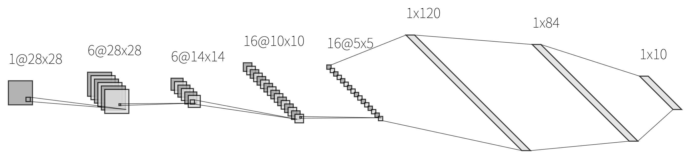
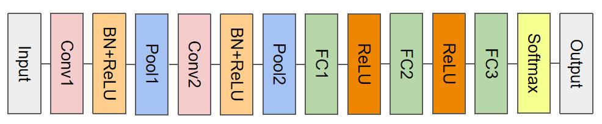
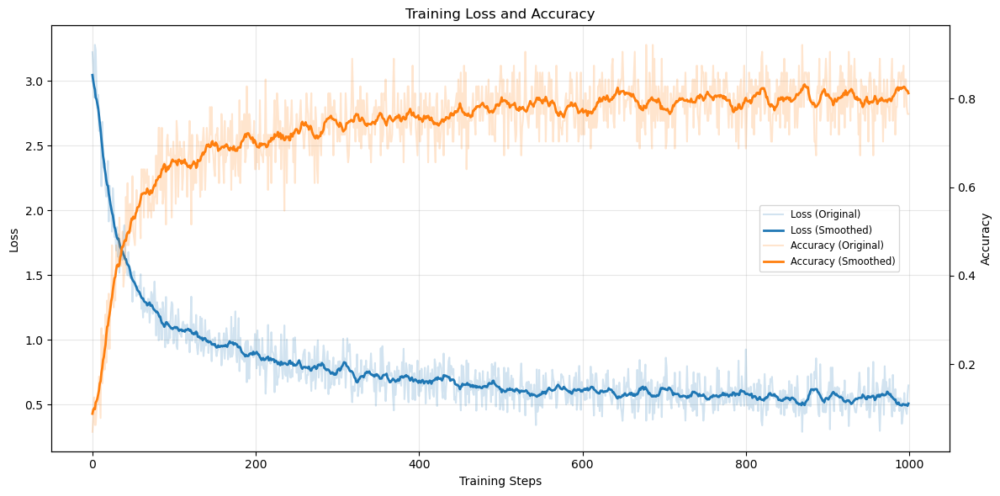
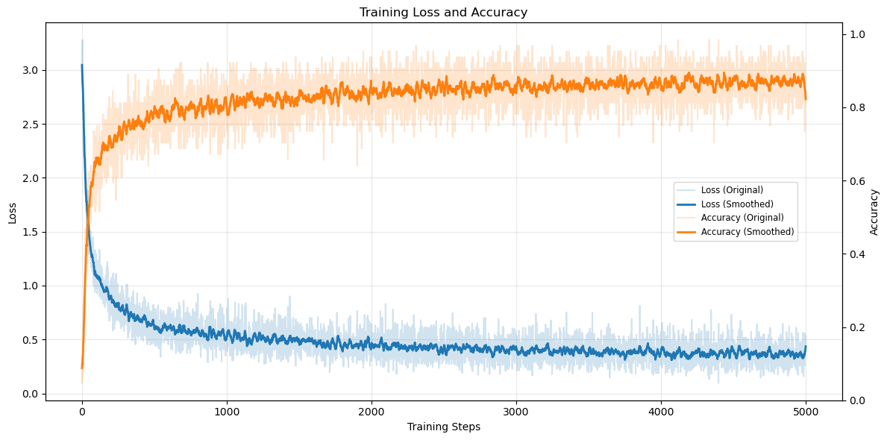
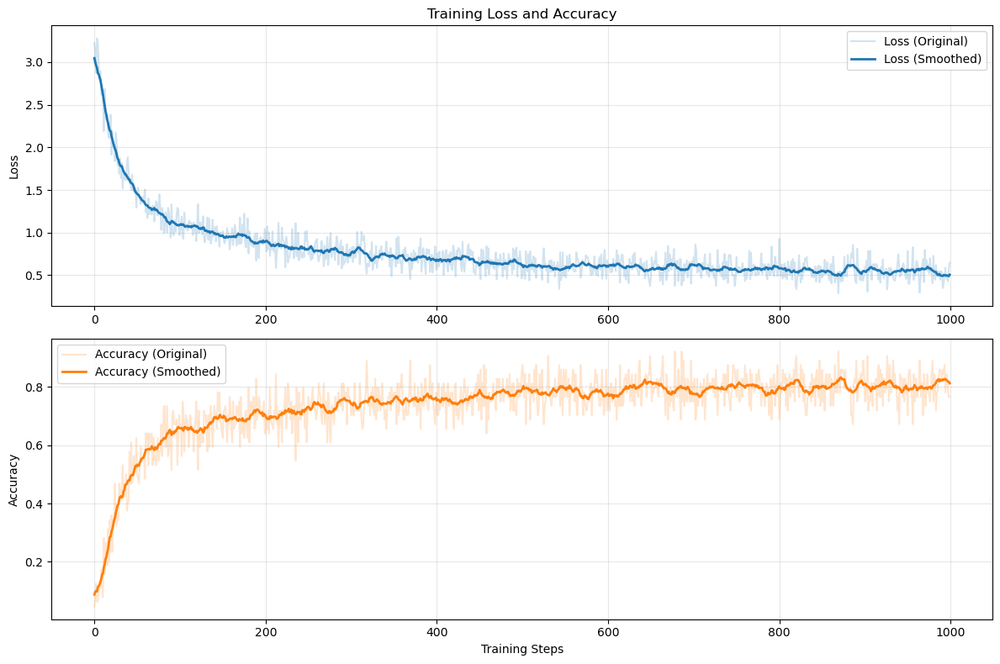
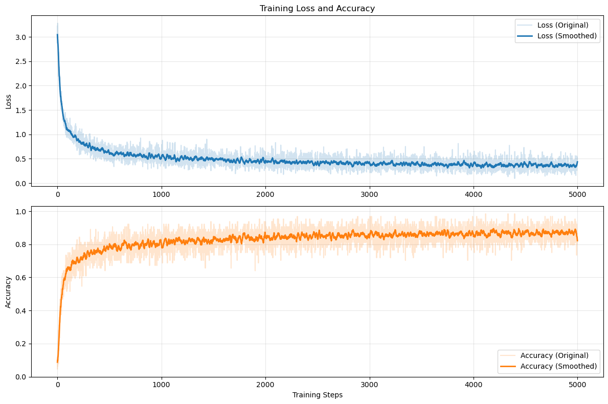
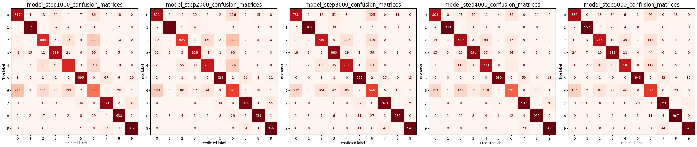

## *[demo_1](./demo.pdf)*

### *model(LeNet)*
```
Layer (type)         Output Shape         Param #
===================================================
Conv2D               (6, 28, 28)          156
BatchNorm            (6, 28, 28)          12
ReLU                 (6, 28, 28)          0
MaxPool2D            (6, 14, 14)          0
Conv2D               (16, 10, 10)         2416
BatchNorm            (16, 10, 10)         32
ReLU                 (16, 10, 10)         0
MaxPool2D            (16, 5, 5)           0
FullyConnected       (120,)               48120
ReLU                 (120,)               0
FullyConnected       (84,)                10164
ReLU                 (84,)                0
FullyConnected       (10,)                850
===================================================
Total params: 61750
```



### *hyper params*
|   *Parameter*   | *Value*  |
| :-------------: | :------: |
|   *max_steps*   |  *5000*  |
|  *batch_size*   |   *64*   |
| *learning_rate* | *0.0005* |

### *loss&accuracy*
| *1000 Steps*     | *5000 Steps*     |
|:----------------:|:----------------:|
|  |  |
|  |  |

### *predict*
```
model                   accuracy
================================
model_step1000.npz       0.8016
model_step2000.npz       0.8264
model_step3000.npz       0.8462
model_step4000.npz       0.8534
model_step5000.npz       0.8612
```

### *confusion matrices*


