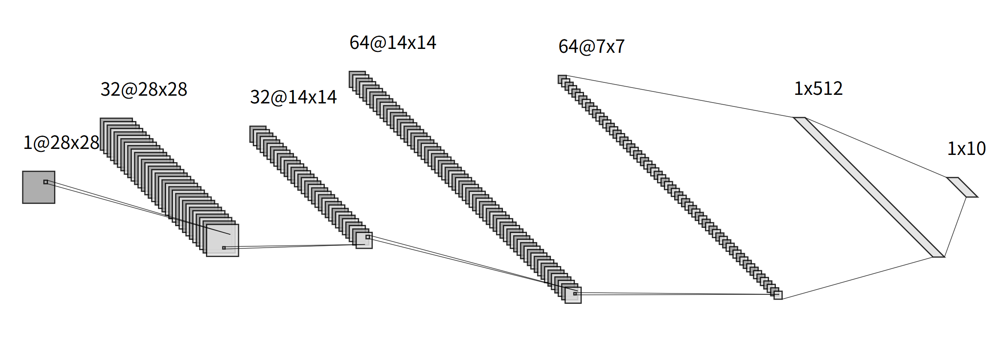
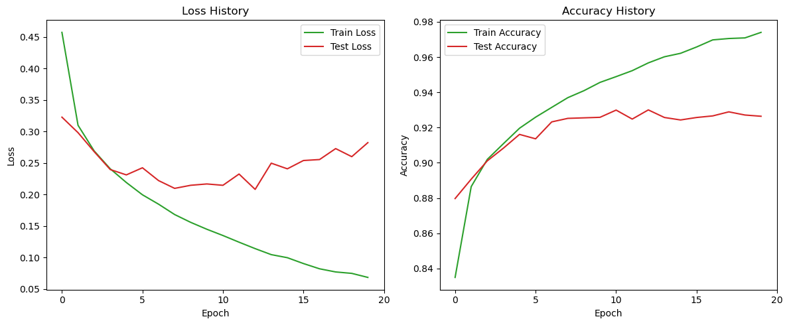

## *[demo_2](./demo.pdf)*

### *model*
```
Param                Shape                Num #     
==================================================
conv1.weight         (32, 1, 3, 3)        288       
conv1.bias           (32,)                32        
bn1.weight           (32,)                32        
bn1.bias             (32,)                32        
conv2.weight         (64, 32, 3, 3)       18432     
conv2.bias           (64,)                64        
bn2.weight           (64,)                64        
bn2.bias             (64,)                64        
fc1.weight           (512, 3136)          1605632   
fc1.bias             (512,)               512       
fc2.weight           (10, 512)            5120      
fc2.bias             (10,)                10        
==================================================
Total params: 1630282
```
 

### *hyper params*
|   *Parameter*   | *Value*  |
| :-------------: | :------: |
|    *epochs*     |   *20*   |
|  *batch_size*   |   *64*   |
| *learning_rate* |  *0.001* |

### *loss&accuracy*
 


### *predict*
```
+-------+---------------+
| Epoch | Test Accuracy |
+-------+---------------+
|   1   |     0.8797    |
|   2   |     0.8907    |
|   3   |     0.9011    |
|   4   |     0.9083    |
|   5   |     0.9161    |
|   6   |     0.9136    |
|   7   |     0.9232    |
|   8   |     0.9252    |
|   9   |     0.9255    |
|   10  |     0.9258    |
|   11  |     0.9299    |
|   12  |     0.9248    |
|   13  |     0.9300    |
|   14  |     0.9257    |
|   15  |     0.9243    |
|   16  |     0.9257    |
|   17  |     0.9266    |
|   18  |     0.9289    |
|   19  |     0.9271    |
|   20  |     0.9264    |
+-------+---------------+
```

### *confusion matrices(best model)*


