# 🌟 Super-Resolution Minimal Reproduction (SISR) 🌟

<!--
[](https://github.com/Nuyoahwjl/SISR/stargazers)

[](https://opensource.org/licenses/MIT)
[](https://github.com/Nuyoahwjl/SISR/commits/main)
[](https://github.com/Nuyoahwjl/SISR)
## 🌈 Demo Results 
-->

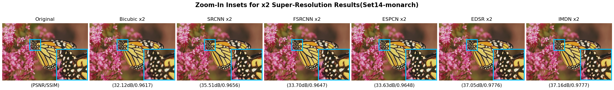 
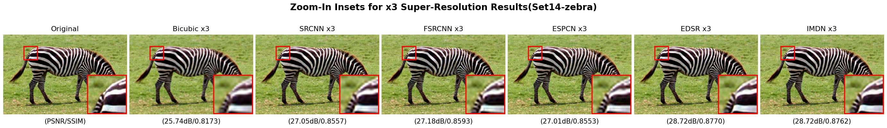
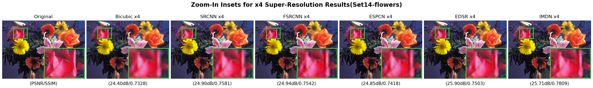 
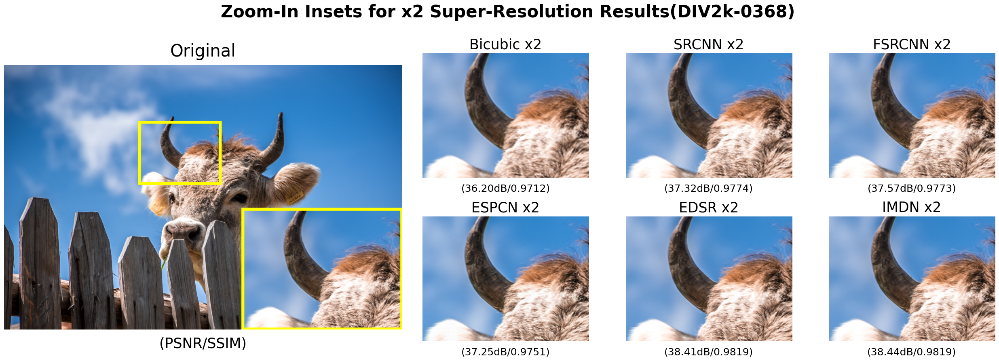
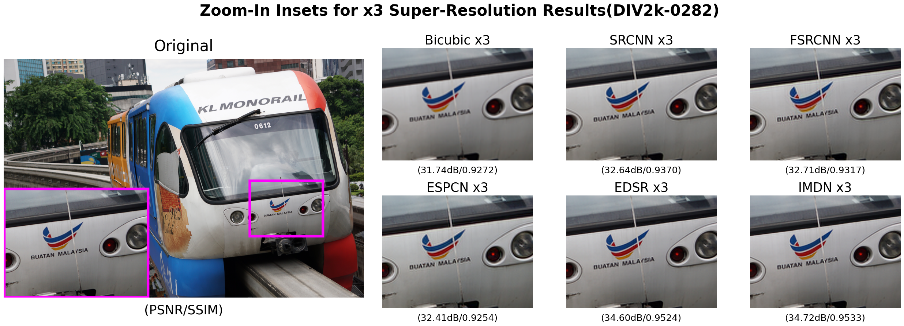 
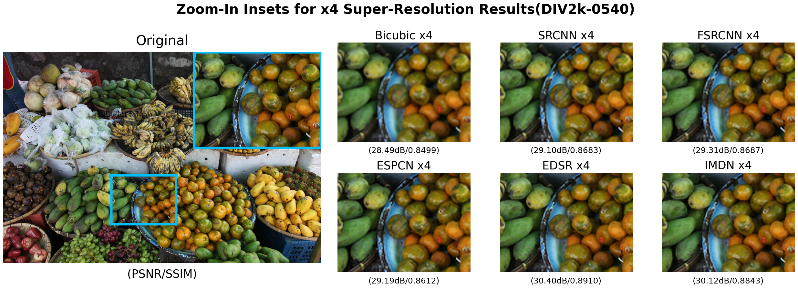

🌈 This repository provides minimal implementations of advanced image super-resolution algorithms:

- ⚡ **SRCNN** (Super-Resolution Convolutional Neural Network)
- 🚀 **FSRCNN** (Fast SRCNN)
- 🌀 **ESPCN** (Efficient Sub-Pixel Convolutional Neural Network)
- 🕹️ **EDSR** (Enhanced Deep Residual Networks)
- 🌐 **IMDN** (Information Multi-Distillation Network)

---

## 🎉 Features

- 📸 **Comprehensive Algorithms**: Includes powerful single-image super-resolution models.
- 🔧 **Ease of Use**: Simplified configuration and training via YAML files.
- 📊 **Standard Benchmarks**: Supports datasets like Set5, Set14, BSD100, and Urban100.

---

## 🤖 PSNR on Set5

<!-- | **_Scale_** | **_SRCNN_** | **_FSRCNN_** | **_ESPCN_** | **_EDSR_** | **_IMDN_** |
|---|---|---|---|---|---|
| x2 | 34.40 | 34.35 | 33.99 | 36.58 | 36.62 |
| x3 | 30.48 | 30.40 | 30.23 | 32.17 | 32.24 |
| x4 | 28.09 | 28.24 | 28.04 | 29.60 | 29.32 | -->

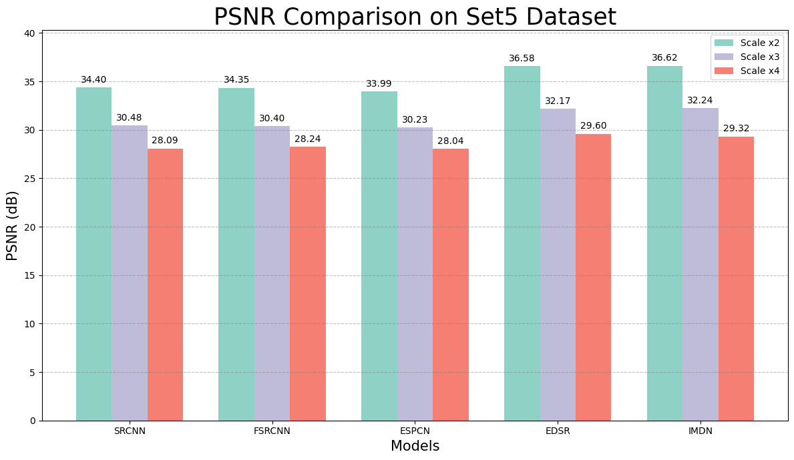

---

## 💻 Quick Start

### 🚩 Installation

```bash
pip install -r requirements.txt
```

### 📂 Dataset Structure

The repository assumes the following dataset directory structure:

```yaml
project_root/
  data/
    DIV2K_train_HR/
    T91/
    Set5/
    Set14/
```

- **🏋️ Training**: `T91` and `DIV2K_train_HR`
- **🧪 Validation & 🚦 Testing**: `Set5`, `Set14`, `BSD100`, and `Urban100`

⚠️ *No need to prepare LR images manually; bicubic down-sampling is performed dynamically!*

---

## 🎯 Training

```bash
python train.py --config configs/srcnn_x2.yaml
```

---

## 📈 Evaluation

### Example: Testing with Set14 🗂️

```bash
python test.py \
  --ckpt output/srcnn_x2/best.pt \
  --test_dir data/Set14 \
  --model srcnn \
  --scale 2 \
  --save_images \
  --out_dir output/srcnn_x2/test \
  --json output/srcnn_x2/test/metrics.json
```

### Example: Testing with Custom Demo Data 🎨

```bash
python test.py \
  --ckpt output/srcnn_x2/best.pt \
  --test_dir demo/original \
  --model srcnn \
  --scale 2 \
  --save_images \
  --out_dir demo/srcnn_x2 \
  --json demo/srcnn_x2/metrics.json
```

---

## 📚 References 📚

👓 Relevant papers for implemented algorithms:

- 🧠 **SRCNN**: Dong, Chao, et al. *"Learning a Deep Convolutional Network for Image Super-Resolution."* In *European Conference on Computer Vision (ECCV)*, 2014. This paper introduces the Super-Resolution Convolutional Neural Network (SRCNN), a pioneering deep learning-based approach for image super-resolution. ([Paper Link](https://arxiv.org/abs/1501.00092))

- 🌟 **FSRCNN**: Dong, Chao, et al. *"Accelerating the Super-Resolution Convolutional Neural Network."* In *European Conference on Computer Vision (ECCV)*, 2016. This work builds upon SRCNN, proposing a faster and more efficient architecture for real-time applications. ([Paper Link](https://arxiv.org/abs/1608.00367))

- 🔍 **ESPCN**: Shi, Wenzhe, et al. *"Real-Time Single Image and Video Super-Resolution Using an Efficient Sub-Pixel Convolutional Neural Network."* In *IEEE Conference on Computer Vision and Pattern Recognition (CVPR)*, 2016. This paper introduces the sub-pixel convolution layer, enabling real-time super-resolution for both images and videos. ([Paper Link](https://arxiv.org/abs/1609.05158))

- 🎨 **EDSR**: Lim, Bee, et al. *"Enhanced Deep Residual Networks for Single Image Super-Resolution."* In *IEEE Conference on Computer Vision and Pattern Recognition (CVPR) Workshops*, 2017. This work proposes an enhanced residual network architecture, achieving state-of-the-art performance on multiple benchmarks. ([Paper Link](https://arxiv.org/abs/1707.02921))

- ✨ **IMDN**: Hui, Zheng, et al. *"Lightweight Image Super-Resolution with Information Multi-Distillation Network."* In *ACM International Conference on Multimedia (ACM MM)*, 2019. This paper presents a lightweight and efficient network designed for high-quality image super-resolution with reduced computational cost. ([Paper Link](https://arxiv.org/abs/1909.11856))

---

## ✅ Appendix:Model Metrics

<table>
<tr>
<td></td>
<td>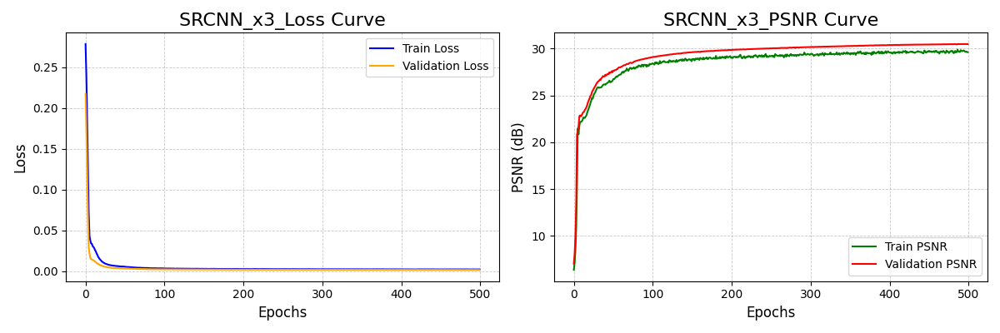</td>
<td>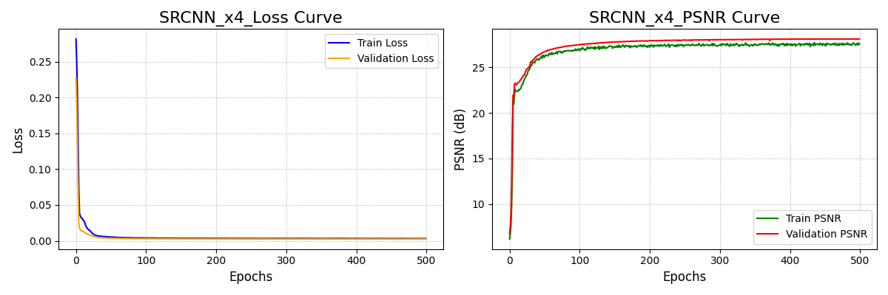</td>
</tr>
<tr>
<td>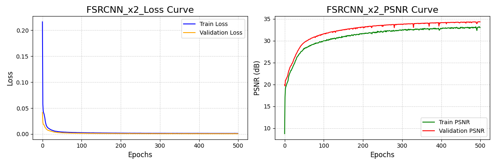</td>
<td>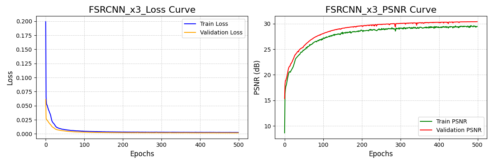</td>
<td>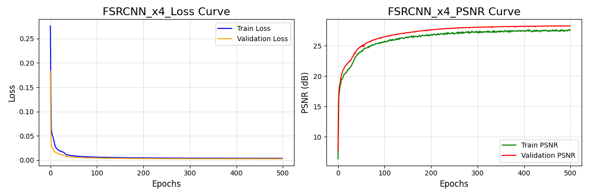</td>
</tr>
<td>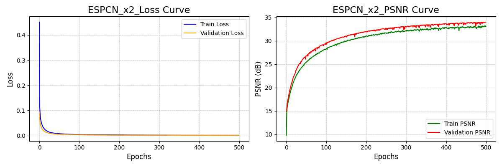</td>
<td>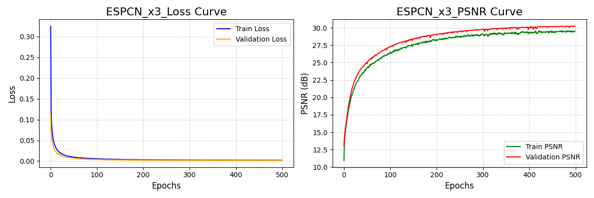</td>
<td>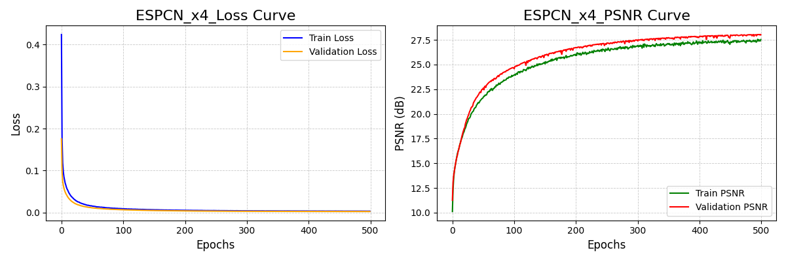</td>
</tr>
<td>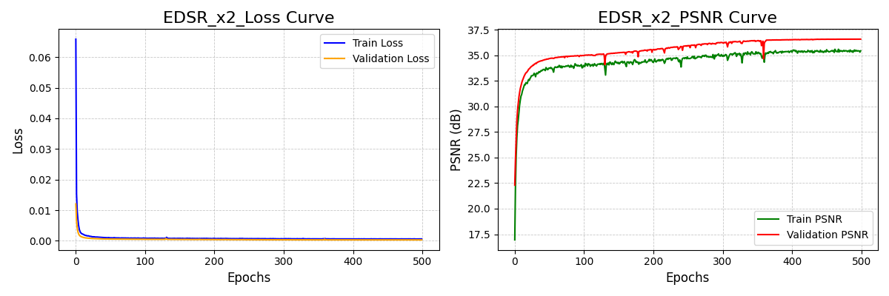</td>
<td>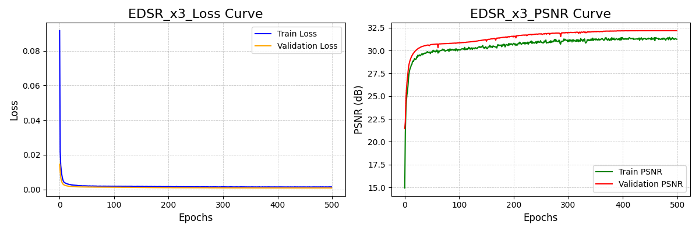</td>
<td>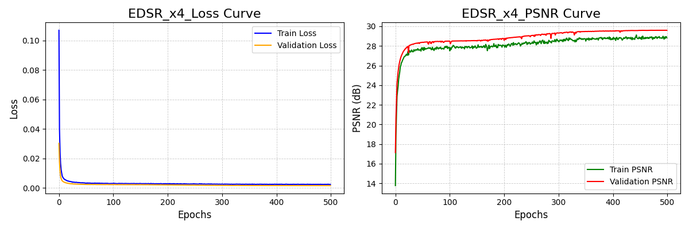</td>
</tr>
<td>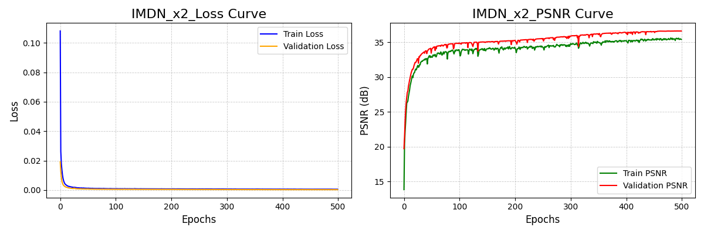</td>
<td>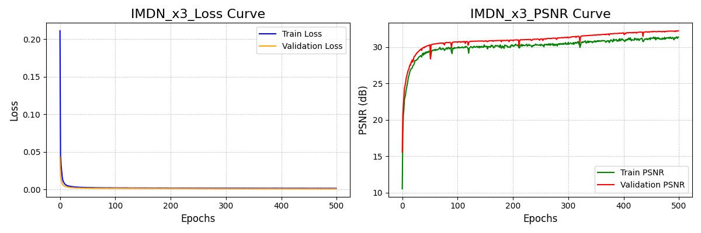</td>
<td>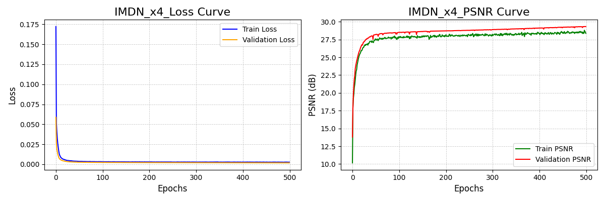</td>
</tr>
</table>

---

🥪 **Happy Super-Resolution!** Please ⭐ this repository if you find it useful!
