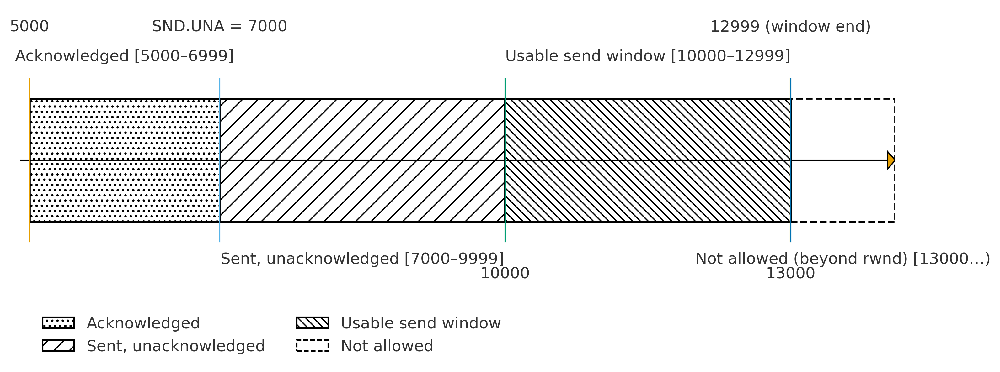

## 题目1

**(1)**
* **可靠传输**：确保数据不丢失、不乱序、不重复、无差错地到达应用（按字节流有序交付）；关注正确性与完整性，为此容忍一定时延与开销（重传、确认、缓冲）。
* **不可靠传输**：尽力而为，不保证交付与顺序，遇到丢包/差错也不自动恢复；关注低时延、低抖动、低开销，把容错交给应用层。

**(2)**
1. **字节编号与累计确认（Seq/ACK）**：为每个字节编号，发送端在发送每一个数据段时，都会在报文头中带上该段数据第一个字节的序列号,接收端用“下一个期望字节号”进行累计确认，实现**有序重组**与**丢失/重复检测**。
2. **重传控制（ARQ）**：基于超时重传（RTO）和冗余ACK触发的快速重传，在检测到丢失时可靠重发。
3. **滑动窗口与流量控制（rwnd）**：按接收端可用缓存大小调节发送速率，避免溢出，并维持端到端有序、可靠推进。

**(3)**
* **功能A**：选TCP。
* **功能B**：选UDP。

**(4)**
文件传输要求“零差错 + 完整可用”。UDP遇到丢包、乱序、重复不会自动恢复，需要在应用层再造一套可靠机制（确认、重传、拥塞与流控等）；而TCP已成熟实现端到端可靠、按序、拥塞与流控，能确保文件可用性并在复杂网络中保持稳健与公平。

**(5)**
实时通话最怕延迟与抖动。TCP的重传与队头阻塞会把后续数据卡住，为“追求完整性”牺牲“实时性”；而UDP允许按时到达优先，丢少量包也可通过在应用层处理，整体体验更流畅。

**(6)**
不正确。“性能”取决于场景与指标。低时延实时流可能更适合UDP，但文件/事务常常TCP更高效稳健。

**(7)**
* **原因**：低握手开销、可定制、低时延、更灵活。DNS报文小且请求-响应短；语音/视频重时延轻丢包。
* **做法**：在应用层进行：序列号与丢包检测、NACK/重传、FEC/冗余编码、抖动缓冲、速率自适应、拥塞友好算法。

---

## 题目2
设：每段1000B，ISS=5000；B的初始rwnd=8000；忽略拥塞控制。

**(1)**
* 第1段：起始 5000，长度1000 → **[5000, 5999]**
* 第5段：起始 5000 + (5−1)×1000 = 9000 → **[9000, 9999]**
* 第10段：起始 5000 + (10−1)×1000 = 14000 → **[14000, 14999]**

**(2)**
* **ACK=8000**。含义：**到7999为止均按序收到**，**下一个期望字节是8000**；即便第5段（9000~9999）已缓存，累计确认仍停在缺口处。

**(3)**
* B释放了3000B缓存，**rwnd增大3000B**。
* B通过在**ACK报文的窗口通告字段**中带上新的rwnd来告知A。

**(4)**
① **报文段丢失**：A启动**重传定时器**，超时（RTO）后**重传**该段。
② **报文到达，但ACK=6000丢失**：A迟迟收不到ACK，同样**RTO超时后重传**该段；B发现是重复数据，丢弃重复并再次发送ACK=6000，A接着发送下一报文段。

**(5)**
* **相同**：A都会因未获确认而**重传**，最终**接收方应用只收到一次**有效数据。
* **不同**：①是数据未达导致的重传；②是ACK未达导致的重传（接收端已收到数据）。
* **体现**：TCP的端到端可靠性与幂等重传（重复可检测/丢弃）、累计确认策略。

**(6)**
* 忽略拥塞控制时，发送窗口由rwnd限制，故为***8000B***。

**(7)**
* 已确认：**[5000, 6999]**（2段，2000B）
* 发送未确认：**[7000, 9999]**（第3~5段，3000B）
* 当前发送窗口范围：从**SND.UNA=7000**起，长度**rwnd=6000** → **[7000, 12999]**
* 可发送：窗口中尚未发送部分 **[10000, 12999]**（3000B）
* 不可发送：**[13000, …)**（超出rwnd）

**(8)**
* **3000B**（即10000~12999）。

**(9)**
* **序列号**标识字节位置，接收端能检测丢失/乱序/重复；
* **累计确认**汇报“下一个期望字节”，驱动发送端向前推进；
* **重传**在**超时**或**冗余ACK**提示丢失时重发缺失数据；

**(10)**
* **挑战**：RTT极大且波动，上层ACK返回慢，若RTO估计偏小将频繁误触发超时重传，浪费带宽并引入队头阻塞；若过大又恢复迟缓。
* **优化**：提高**初始RTO**与**最小RTO下限**，并加大RTT平滑与方差容忍（如适当增大RTTVAR权重），减少虚假超时。

---

## 题目3

**(1)**
页面含1个HTML + 3张图片，每个对象使用独立连接：共需要 **4 次**完整的TCP“建立+关闭”。

**(2)**
* 机制：**持久连接**。
* 提升：多个请求/响应**复用同一TCP连接**。

**(3)**
在同一连接上，若**前面的响应/分段**因服务端处理慢或某个TCP段丢失而滞留，后续响应即使已准备好也不能越过，必须按顺序发送/交付，导致**后面的请求被队头阻塞**。

**(4)**
* **应用层HOL**：HTTP/1.1**响应需按序返回**；一个慢资源可阻塞后续。
* **TCP层HOL**：任一分段丢失会让后续字节等待重传确认。
* **并发受限**：浏览器对同一域名的并发连接数有限（即便1.1允许多连接，仍可能受限于域、带宽与服务器能力）。
* **拥塞控制与慢启动**：连接上行进程仍受慢启动、拥塞避免的窗口增长节奏影响。

**(5) 从HTTP/1.0到HTTP/1.1体现的协议设计思想**
* **把“握手/建连”开销摊薄**（持久化复用）以提升整体效率；
* **在可靠传输之上做应用层复用与优化**（复用连接、减少冗余往返）。

