# 实验二

## 0. 实验前的准备 & 基本操作

### 0.1 包管理器UV

1. **下载UV Python包管理器** 
   
   ```bash
   curl -LsSf https://astral.sh/uv/install.sh | sh
   ```
   
   UV官网：[uv](https://docs.astral.sh/uv/) 

2. **安装依赖和初始化** 
   依赖已经写入相关文件，同学们只需要运行`uv sync`进行同步即可
   
   ```bash
   uv sync # 同步项目依赖到环境
   # 其他常用的命令,未列出的命令可以使用 uv -h 或访问官网查看
   
   uv init # 创建新 Python 项目
   uv add # 为项目添加依赖
   uv remove # 从项目移除依赖
   uv lock # 为项目依赖创建锁文件
   uv run # 在项目环境中运行命令(不会影响终端环境)
           # 若想要在终端中手动启用环境,运行source $SOURCE_DIR$/.venv/bin/activate
           # 终端用户名前出现"(环境名)"即表示启用成功
   uv tree # 查看项目依赖树
   ```

3. **运行OS-Ken App** 
   启动OS-Ken App
   
   ```bash
   uv run osken-manager simple_switch.py
   ```
   
   

### 0.2 OVS相关命令

- 查看交换机`s1`的流表
  
  ```bash
  sudo ovs-ofctl dump-flows s1 # 在终端中打印交换机s1的流表
  ```
  
  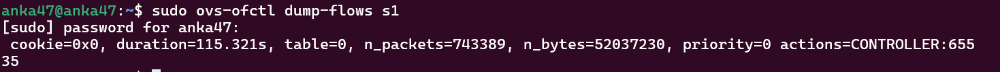

- 查看所有交换机的流表
  
  ```bash
  dpctl dump-flows # 在mininet终端中打印所有交换机的流表
  ```
  
  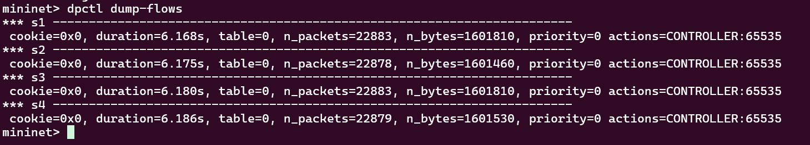

  
  
  

### 0.3 使用wireshark对控制器进行抓包

- 命令(mininet终端中):
  
  ```bash
  h1 wireshark # 启动wireshark，并将主机h1添加至wireshark监听端口中
  h1 wireshark & # 后台启动wireshark，并将主机h1添加至wireshark监听端口中
  ```
  
  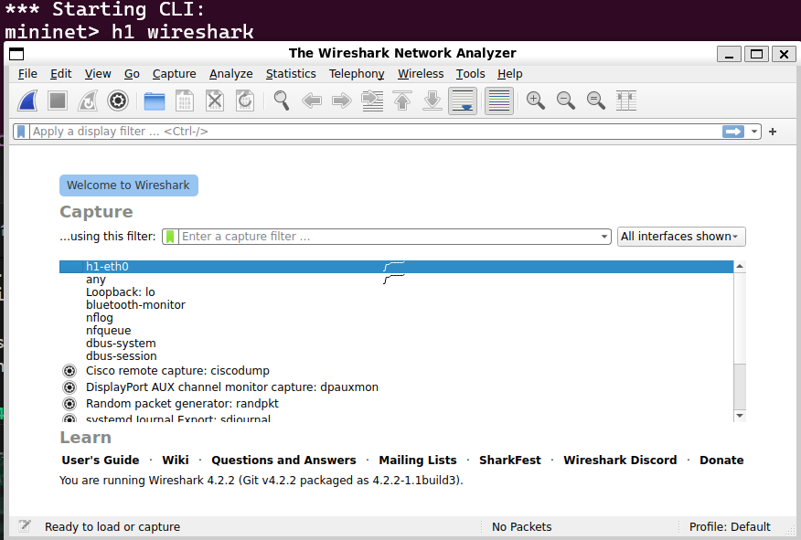

- wireshark过滤操作（此处仅给出过滤协议的方法）：
  在搜索框填写过滤规则并单击蓝色右箭头即可
  eg:
  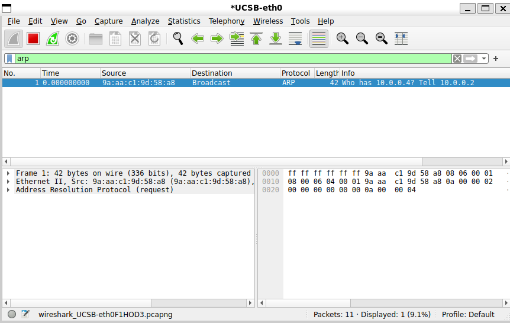

### 0.4 Linux中的常用命令

- `ctrl+c`: 终止程序执行

- `ctrl+r`：搜索终端中的历史命令
  eg:
  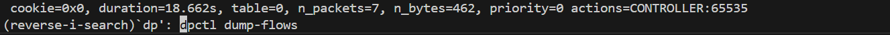
  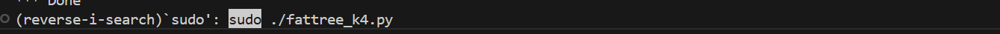

- `a|b`：管道命令，将a的输出重定向至`b` 
  eg:
  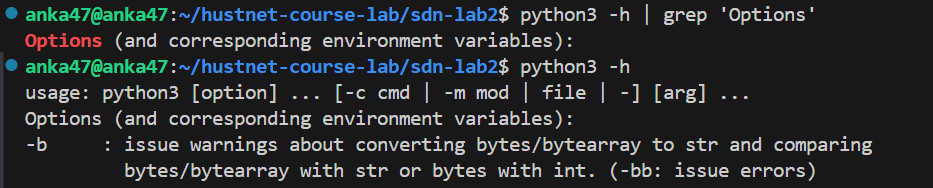

- `a > b.txt`：将a的输出重定向至文件`b.txt` 
  注意：`>`默认以覆盖的方式写入文件
  
  

## 1. 简单交换机示例

```python
from os_ken.base import app_manager
from os_ken.controller import ofp_event
from os_ken.controller.handler import MAIN_DISPATCHER, CONFIG_DISPATCHER
from os_ken.controller.handler import set_ev_cls
from os_ken.ofproto import ofproto_v1_3

class L2Switch(app_manager.OSKenApp):
    OFP_VERSIONS = [ofproto_v1_3.OFP_VERSION]

    def __init__(self, *args, **kwargs):
        super(L2Switch, self).__init__(*args, **kwargs)
    
    def add_flow(self, datapath, priority, match, actions):
        dp = datapath
        ofp = dp.ofproto
        parser = dp.ofproto_parser

        inst = [parser.OFPInstructionActions(ofp.OFPIT_APPLY_ACTIONS, actions)]
        mod = parser.OFPFlowMod(datapath=dp, priority=priority, match=match, instructions=inst)
        dp.send_msg(mod)
 
	# add default flow table which sends packets to the controller
    @set_ev_cls(ofp_event.EventOFPSwitchFeatures, CONFIG_DISPATCHER)
    def switch_features_handler(self, ev):
        msg = ev.msg
        dp = msg.datapath
        ofp = dp.ofproto
        parser = dp.ofproto_parser

        match = parser.OFPMatch()
        actions = [parser.OFPActionOutput(ofp.OFPP_CONTROLLER, ofp.OFPCML_NO_BUFFER)]
        self.add_flow(dp, 0, match, actions)

	# handle packet_in message
    @set_ev_cls(ofp_event.EventOFPPacketIn, MAIN_DISPATCHER)
    def packet_in_handler(self, ev):
        msg = ev.msg
        dp = msg.datapath
        ofp = dp.ofproto
        parser = dp.ofproto_parser

        actions = [parser.OFPActionOutput(ofp.OFPP_FLOOD)]

        out = parser.OFPPacketOut(
            datapath=dp, buffer_id=msg.buffer_id, in_port=msg.match['in_port'],actions=actions, data=msg.data)
        dp.send_msg(out)
```

在简单交换机示例中，控制平面对所有通过交换机的数据包均采取广播操作，即向除入端口以外的所有端口转发

## 2. 实验任务

### 2.1 自学习交换机

#### 2.1.1 下载项目文件
```bash
git clone https://github.com/cxy0629/sdn-lab2.git
cd sdn-lab2
```

#### 2.1.2 安装依赖和初始化
```bash
uv sync
```

#### 2.1.3 使用python虚拟环境运行控制器和网络拓扑
进入虚拟环境，执行后Shell prompt前会出现(lab2)的提示，表明你在'venv'虚拟环境中
```bash
source .venv/bin/activate
```
退出虚拟环境
```bash
deactivate
```
为了观察控制器和网络，你需要分别打开两个终端
- 运行控制器
```bash
osken-manager simple_switch.py
```
- 运行网络拓扑
```bash
sudo ./topo_1.py
```
#### 2.1.4 问题描述
- 网络结构
  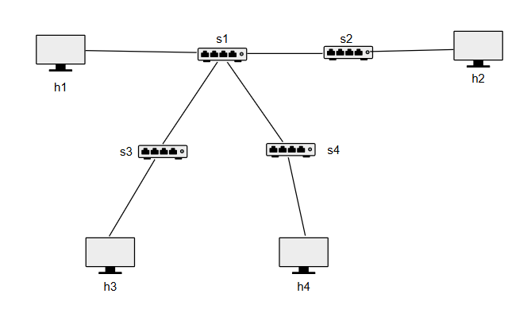
  对应topo_1.py

- 简单交换机的缺陷
根据前文操作运行simple_switch.py与topo_1.py，同时在mininet的CLI中启动wireshark对h3端口eth0抓包
```bash
h3 wireshark &
```
继续在mininet的CLI中，h4和h2进行通信
```bash
h4 ping h2
```
观察wireshark中的抓包情况

抓包结果显示控制器存在缺陷，packet_in_handler函数会将所有报文洪泛到交换机的所有端口，因此能在h3的eth0端口接收到10.0.0.2(h2)与10.0.0.4(h4)之间的通信


#### 2.1.5 实验要求

在学习simple_switch.py的基础上，完善self_learning_switch.py，通过控制平面下发流表完成交换机的自学习功能，具体要求如下：
- 完善自学习逻辑：
  1.控制器需要维护一个mac_to_port映射表，用于记录每一个交换机对于mac地址的转发端口，即(dpid,mac)->port，可以使用嵌套字典来实现
  2.若流表匹配，则交换机通过流表信息转发，无需控制器介入操作；若流表不匹配，交换机则会触发控制器的packet_in_handler函数
  3.在packet_in_handler函数中，控制器先记录(dpid,src_mac)->in_port映射，再查询映射表中是否存在(dpid,dst_mac)的映射，若存在，向指定端口转发并下发流表，否则洪泛数据包

- 观察控制器的输出并分析：
  1.在packet_in_handler函数内使用```self.logger.info()```打印输出**映射表命中时**的转发信息，输出格式为(dpid,src_mac,in_port,dst_mac,out_port)五元组，内容将会被输出在控制器终端内
  2.使用```h4 ping h2```，根据自学习逻辑，分析控制器输出内容，判断h4和h2的mac地址以及与它们相连交换机的端口号
  3.注意add_flow函数下发流表时默认硬超时参数(hard_timeout)为0，在packet_in_handler函数内为流表下发指定hard_timeout=5，观察控制器输出信息的规律，并比较与hard_timeout=0情形下的差别，思考原因

#### 2.1.6 代码框架
以下是代码框架，只需要在特定处补充代码即可
```python
from os_ken.base import app_manager
from os_ken.controller import ofp_event
from os_ken.controller.handler import MAIN_DISPATCHER, CONFIG_DISPATCHER
from os_ken.controller.handler import set_ev_cls
from os_ken.ofproto import ofproto_v1_3
from os_ken.lib.packet import packet
from os_ken.lib.packet import ethernet

class Switch(app_manager.OSKenApp):
    
    OFP_VERSIONS = [ofproto_v1_3.OFP_VERSION]
    def __init__(self, *args, **kwargs):
        super(Switch, self).__init__(*args, **kwargs)
        # maybe you need a global data structure to save the mapping
      
        
    def add_flow(self, datapath, priority, match, actions,idle_timeout=0,hard_timeout=0):
        dp = datapath
        ofp = dp.ofproto
        parser = dp.ofproto_parser
        inst = [parser.OFPInstructionActions(ofp.OFPIT_APPLY_ACTIONS, actions)]
        mod = parser.OFPFlowMod(datapath=dp, priority=priority,
                                idle_timeout=idle_timeout,
                                hard_timeout=hard_timeout,
                                match=match,instructions=inst)
        dp.send_msg(mod)
        
    @set_ev_cls(ofp_event.EventOFPSwitchFeatures, CONFIG_DISPATCHER)
    def switch_features_handler(self, ev):
        msg = ev.msg
        dp = msg.datapath
        ofp = dp.ofproto
        parser = dp.ofproto_parser
        match = parser.OFPMatch()
        actions = [parser.OFPActionOutput(ofp.OFPP_CONTROLLER,ofp.OFPCML_NO_BUFFER)]
        self.add_flow(dp, 0, match, actions)
        
    @set_ev_cls(ofp_event.EventOFPPacketIn, MAIN_DISPATCHER)
    def packet_in_handler(self, ev):
        msg = ev.msg
        dp = msg.datapath
        ofp = dp.ofproto
        parser = dp.ofproto_parser
        
        # the identity of switch
        dpid = dp.id
        # the port that receive the packet
        in_port = msg.match['in_port']
        pkt = packet.Packet(msg.data)
        eth_pkt = pkt.get_protocol(ethernet.ethernet)
        # get the mac
        dst = eth_pkt.dst
        src = eth_pkt.src
    
        # You need to code here to avoid the direct flooding
        # Have fun!
        # :)

```
#### 2.1.7 结果验证
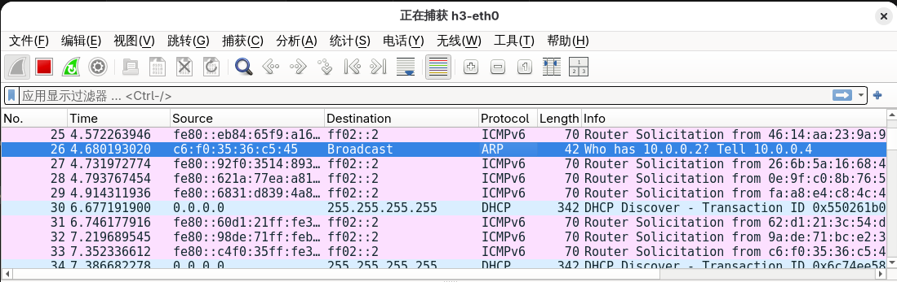
运行self_learning_switch.py与topo_1.py，使用```h4 ping h2```后，发现h3从ARP后未收到过h4与h2之间通信的数据包，说明成功实现自学习交换机

### 2.2 处理环路广播
#### 2.2.1 问题描述
- 网络结构
  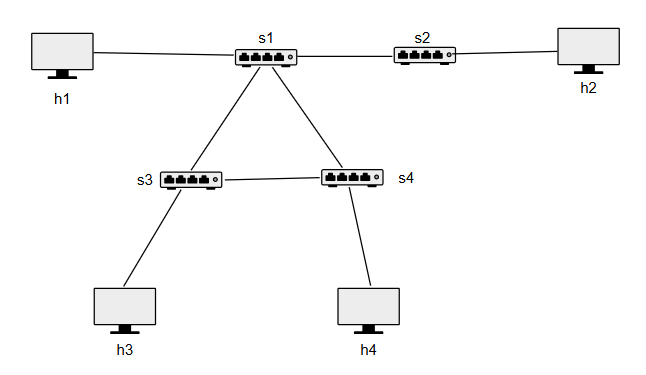
  对应topo_2.py
- 自学习交换机的缺陷
  运行self_learning_switch.py和topo_2.py，发现h4与h2之间无法正常通信
  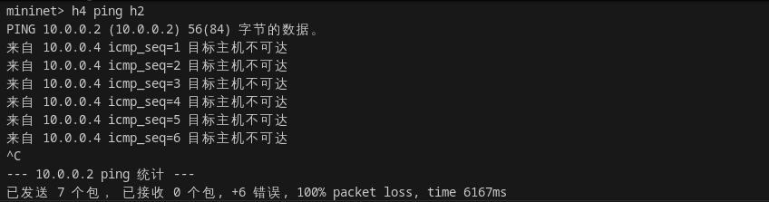
  查看流表信息
  ```bash
  dpctl dump-flows
  ```
  发现网络内的数据包数目和流表匹配次数巨大(通过观察n_packets参数可知)，这不符合正常通信的逻辑
  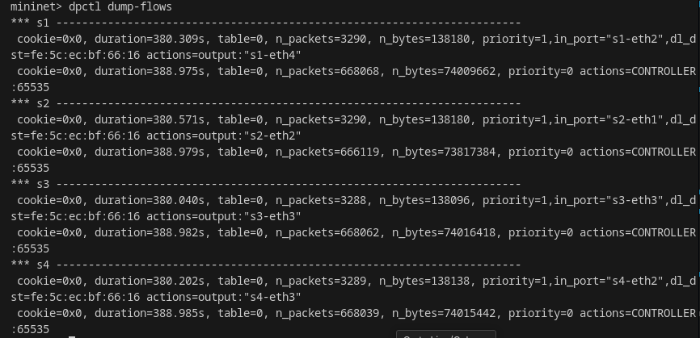
  对h3的eth0端口抓包,可以发现与本次通信无关的h3主机也收到了大量数据包，同时夹杂着大量的ARP数据包
  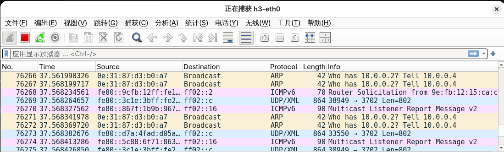
  **原因分析**：为使h4和h2正常通信，通信前h4需在数据链路层层次广播ARP数据包来获取h2的IP地址与MAC地址的映射关系。比较topo_1.py与topo_2.py的网络结构，发现topo_2.py在s3和s4之间增加了一条链路，在s1、s3、s4之间形成了环路，广播的数据包会在环路中不断来回转发(称为环路广播)，淹没了正常通信的数据包，使得h4与h2无法正常通信。另外，我们能在h3的抓包过程中，发现有重复的ARP数据包，观察wireshark内的info字段可知它们的内容均为ARP Request(10.0.0.4在询问谁拥有10.0.0.2)，这也佐证了环路广播

#### 2.2.2 实验要求
在完成self_learning_switch.py的基础上，完善loop_breaker_switch.py和loop_detecting_switch.py(保留**2.1.5节**的映射表命中输出逻辑，同时为了方便观察，使用**默认**hard_timeout)，这两份代码文件提供了两种解决环路广播的思路，具体要求如下：

##### 2.2.2.1 loop_breaker_switch.py
- 思路：本任务中的环路包含三条链路，分别为(s1,s3)、(s1,s4)、(s3,s4)，断开任意一条链路的连接能够消除环路且不影响网络结构的连通性，可以通过禁用交换机端口来实现链路断连。理论上禁用三条链路的六个端口中的任意一个即可，但为了更清楚地观察禁用端口后对通信路径的影响，统一要求禁用交换机s1的端口
- 实验步骤与要求：
  1.运行self_learning_switch.py和topo_2.py，执行```h4 ping h2```，观察控制器的输出，判断交换机s1与s3、s4相连的端口号
  2.完善loop_breaker_switch.py代码，在packet_in_handler函数内使用OFFPortMod消息修改交换机的端口配置(注意仅需修改一次)，消息参数如下图
  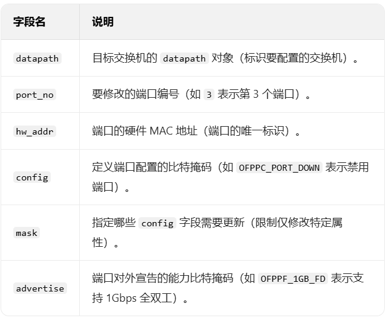
  3.分别禁用s1与s3和s1与s4相连的端口，执行```h4 ping h2```，比较控制器的输出变化，分析原因
- 代码框架
  以下是代码框架，只需要在特定处补充代码即可
  ```python
  from os_ken.base import app_manager
  from os_ken.controller import ofp_event
  from os_ken.controller.handler import MAIN_DISPATCHER, CONFIG_DISPATCHER
  from os_ken.controller.handler import set_ev_cls
  from os_ken.ofproto import ofproto_v1_3
  from os_ken.lib.packet import packet
  from os_ken.lib.packet import ethernet
  from os_ken.lib.packet import arp
  from os_ken.lib.packet import ether_types

  ETHERNET = ethernet.ethernet.__name__
  ETHERNET_MULTICAST = "ff:ff:ff:ff:ff:ff"
  ARP = arp.arp.__name__


  class Switch_Dict(app_manager.OSKenApp):
      OFP_VERSIONS = [ofproto_v1_3.OFP_VERSION]

      def __init__(self, *args, **kwargs):
          super(Switch_Dict, self).__init__(*args, **kwargs)
          self.flag = 0 # only modify once
          # maybe you need a global data structure to save the mapping
          # just data structure in mission 1
              

      def add_flow(self, datapath, priority, match, actions, idle_timeout=0, hard_timeout=0):
          dp = datapath
          ofp = dp.ofproto
          parser = dp.ofproto_parser
          inst = [parser.OFPInstructionActions(ofp.OFPIT_APPLY_ACTIONS, actions)]
          mod = parser.OFPFlowMod(datapath=dp, priority=priority,
                                  idle_timeout=idle_timeout,
                                  hard_timeout=hard_timeout,
                                  match=match, instructions=inst)
          dp.send_msg(mod)

      @set_ev_cls(ofp_event.EventOFPSwitchFeatures, CONFIG_DISPATCHER)
      def switch_features_handler(self, ev):
          msg = ev.msg
          dp = msg.datapath
          ofp = dp.ofproto
          parser = dp.ofproto_parser
          match = parser.OFPMatch()
          actions = [parser.OFPActionOutput(ofp.OFPP_CONTROLLER, ofp.OFPCML_NO_BUFFER)]
          self.add_flow(dp, 0, match, actions)
                  


      @set_ev_cls(ofp_event.EventOFPPacketIn, MAIN_DISPATCHER)
      def packet_in_handler(self, ev):
          msg = ev.msg
          dp = msg.datapath
          ofp = dp.ofproto
          parser = dp.ofproto_parser

          # the identity of switch
          dpid = dp.id
          # the port that receive the packet
          in_port = msg.match['in_port']
          pkt = packet.Packet(msg.data)
          eth_pkt = pkt.get_protocol(ethernet.ethernet)
          if eth_pkt.ethertype == ether_types.ETH_TYPE_LLDP:
              return
          if eth_pkt.ethertype == ether_types.ETH_TYPE_IPV6:
              return
          # get the mac
          dst = eth_pkt.dst
          src = eth_pkt.src
          
          # you need to code here to avoid broadcast loop to finish mission 2
          if dpid == 1 and self.flag == 0:
              target_port = ...
              pass

          # self-learning
          # you need to code here to avoid the direct flooding
          # having fun
          # :)
          # just code in mission 1
          
  ```

##### 2.2.2.2 loop_detecting_switch.py
- 实验思路与要求：上一种方法需要事先知道网络的具体端口信息，不具有一般性，且破坏了网络本身结构。新方法维护一个映射表sw，用于记录ARP Request数据包在网络中的转发情况，具体结构为(dpid,src_mac,dst_ip)->in_port。当编号为dpid的交换机从in_port第一次收到src_mac主机发出的询问dst_ip的ARP Request数据包时，控制器根据sw结构记录下映射。下一次该交换机收到同一(src_mac,dst_ip)但in_port不同ARP Request数据包时(**此时认为已经产生环路**)，不执行任何转发操作
- 代码框架
  以下是代码框架，只需要在特定处补充代码即可
  ```python
  from os_ken.base import app_manager
  from os_ken.controller import ofp_event
  from os_ken.controller.handler import MAIN_DISPATCHER, CONFIG_DISPATCHER
  from os_ken.controller.handler import set_ev_cls
  from os_ken.ofproto import ofproto_v1_3
  from os_ken.lib.packet import packet
  from os_ken.lib.packet import ethernet
  from os_ken.lib.packet import arp
  from os_ken.lib.packet import ether_types

  ETHERNET = ethernet.ethernet.__name__
  ETHERNET_MULTICAST = "ff:ff:ff:ff:ff:ff"
  ARP = arp.arp.__name__


  class Switch_Dict(app_manager.OSKenApp):
      OFP_VERSIONS = [ofproto_v1_3.OFP_VERSION]

      def __init__(self, *args, **kwargs):
          super(Switch_Dict, self).__init__(*args, **kwargs)
          self.sw = {} #(dpid, src_mac, dst_ip)=>in_port, you may use it in mission 2
          # maybe you need a global data structure to save the mapping
          # just data structure in mission 1
          
      def add_flow(self, datapath, priority, match, actions, idle_timeout=0, hard_timeout=0):
          dp = datapath
          ofp = dp.ofproto
          parser = dp.ofproto_parser
          inst = [parser.OFPInstructionActions(ofp.OFPIT_APPLY_ACTIONS, actions)]
          mod = parser.OFPFlowMod(datapath=dp, priority=priority,
                                  idle_timeout=idle_timeout,
                                  hard_timeout=hard_timeout,
                                  match=match, instructions=inst)
          dp.send_msg(mod)

      @set_ev_cls(ofp_event.EventOFPSwitchFeatures, CONFIG_DISPATCHER)
      def switch_features_handler(self, ev):
          msg = ev.msg
          dp = msg.datapath
          ofp = dp.ofproto
          parser = dp.ofproto_parser
          match = parser.OFPMatch()
          actions = [parser.OFPActionOutput(ofp.OFPP_CONTROLLER, ofp.OFPCML_NO_BUFFER)]
          self.add_flow(dp, 0, match, actions)

      @set_ev_cls(ofp_event.EventOFPPacketIn, MAIN_DISPATCHER)
      def packet_in_handler(self, ev):
          msg = ev.msg
          dp = msg.datapath
          ofp = dp.ofproto
          parser = dp.ofproto_parser

          # the identity of switch
          dpid = dp.id
          # the port that receive the packet
          in_port = msg.match['in_port']
          pkt = packet.Packet(msg.data)
          eth_pkt = pkt.get_protocol(ethernet.ethernet)
          if eth_pkt.ethertype == ether_types.ETH_TYPE_LLDP:
              return
          if eth_pkt.ethertype == ether_types.ETH_TYPE_IPV6:
              return
          # get the mac
          dst = eth_pkt.dst
          src = eth_pkt.src
          # get protocols
          header_list = dict((p.protocol_name, p) for p in pkt.protocols if type(p) != str)
          if dst == ETHERNET_MULTICAST and ARP in header_list:
              # you need to code here to avoid broadcast loop to finish mission 2
              pass
          

          # self-learning
          # you need to code here to avoid the direct flooding
          # having fun
          # :)
          # just code in mission 1

  ```
#### 2.2.3 结果验证
当h4与h2能正常通信时，说明消除了环路广播
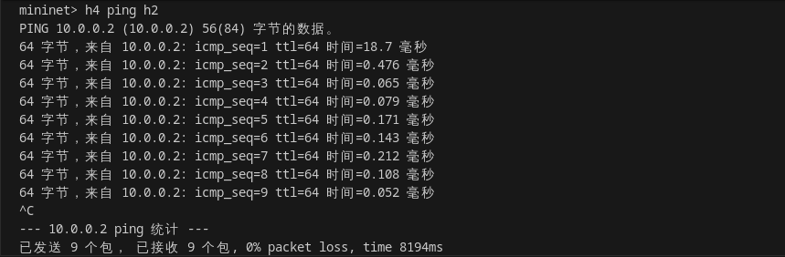

## 3. 参考资料
- SDN论坛：[sdnlab](https://www.sdnlab.com/)
- 关于OS-Ken App开发的更多资料：[OS-Ken Documentation](https://docs.openstack.org/os-ken/latest/)
- 关于Mininet的更多资料：[Mininet Doc](https://github.com/mininet/mininet/wiki/Documentation)，[Mininet API](http://mininet.org/api/annotated.html)