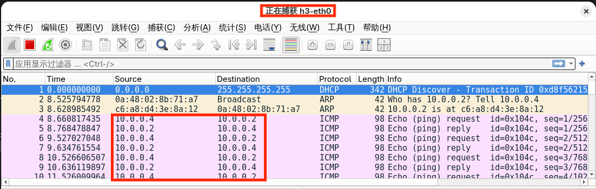
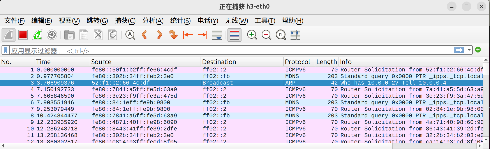

# Task1：自学习交换机

## 环境准备

```bash
# 进入 lab2/ 目录
cd ~/桌面/lab2

# 一键设置环境（推荐）
source setup.sh

# 或者手动执行
uv sync
source .venv/bin/activate
```

## 添加执行权限

```bash
chmod +x topo_1.py
```

---

## 任务目标

实现 MAC 地址自学习，避免无脑洪泛所有端口。

## 网络拓扑（./topo_1.py）

```
    h1 --- s1 --- s2 --- h2
          / \  
         /   \  
        s3   s4
        |     |
        h3   h4
```

- **4 个主机**：h1, h2, h3, h4
- **4 个交换机**：s1, s2, s3, s4

---

## 实验步骤

### 步骤 1：验证简单交换机的缺陷

**终端 1：启动控制器**
```bash
osken-manager simple_switch.py
```

**终端 2：启动网络拓扑**
```bash
sudo ./topo_1.py
```

**Mininet CLI 中：**
```bash
# 启动 Wireshark 抓包（h3 端口）
mininet> h3 wireshark &

# h4 ping h2
mininet> h4 ping -c 3 h2
```

**观察现象：**
- ~~*❌ h3 会收到 h4 和 h2 之间的通信包（不应该收到）*~~

- ~~*❌ `simple_switch.py` 使用洪泛，向所有端口转发*~~

**清理环境：**
```bash
mininet> exit
$ sudo mn -c
```

### 步骤 2：测试自学习交换机

**终端 1：启动控制器**
```bash
osken-manager self_learning_switch.py
```

**终端 2：启动网络拓扑**
```bash
sudo ./topo_1.py
```

**Mininet CLI 中：**
```bash
# 启动 Wireshark 抓包（h3 端口）
mininet> h3 wireshark &

# h4 ping h2
mininet> h4 ping -c 10 h2
```

**观察现象：**
- *✅ h3 只收到 ARP 广播包，不再收到 h4 和 h2 之间的 ICMP 包*

- *✅ 控制器终端显示五元组信息：`(dpid, src_mac, in_port, dst_mac, out_port)`*

**控制器输出：**
```bash
[Packet matched]
dpid=2, src=ca:14:93:cd:8f:05, in_port=1, dst=52:f1:b2:66:4c:df, out_port=2
[Packet matched]
dpid=1, src=ca:14:93:cd:8f:05, in_port=2, dst=52:f1:b2:66:4c:df, out_port=4
[Packet matched]
dpid=4, src=ca:14:93:cd:8f:05, in_port=2, dst=52:f1:b2:66:4c:df, out_port=1
[Packet matched]
dpid=4, src=52:f1:b2:66:4c:df, in_port=1, dst=ca:14:93:cd:8f:05, out_port=2
[Packet matched]
dpid=1, src=52:f1:b2:66:4c:df, in_port=4, dst=ca:14:93:cd:8f:05, out_port=2
[Packet matched]
dpid=2, src=52:f1:b2:66:4c:df, in_port=2, dst=ca:14:93:cd:8f:05, out_port=1
```

### 步骤 3：分析 MAC 地址和端口号

根据控制器输出，分析：

**问题 1**：h2 和 h4 的 MAC 地址是什么？
- h2 的 MAC：`ca:14:93:cd:8f:05`
- h4 的 MAC：`52:f1:b2:66:4c:df`

**问题 2**：通信路径？
- `h2` <-> `(port_1)s2(port_2)` <-> `(port_2)s1(port_4)` <-> `(port_2)s4(port_1)` <-> `h4`

### 步骤 4：测试 hard_timeout 参数

```python
# 场景 1：hard_timeout=0（流表永久有效）
self.add_flow(dp, 1, match, actions, hard_timeout=0)

# 场景 2：hard_timeout=5（流表 5 秒后失效）
self.add_flow(dp, 1, match, actions, hard_timeout=5)
```

**测试场景 1（hard_timeout=0）：**
```bash
mininet> h4 ping -c 10 h2
```
- **观察**：只有前几个包会触发控制器（学习阶段）
- **原因**：流表永久有效，交换机直接转发，不经过控制器

**测试场景 2（hard_timeout=5）：**
```bash
mininet> h4 ping -c 10 h2
```
- **观察**：每隔 5 秒，控制器会再次输出日志
- **原因**：流表 5 秒后失效，需要重新学习

