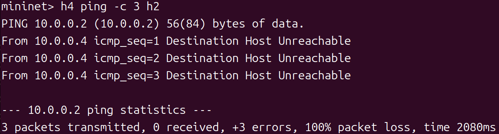
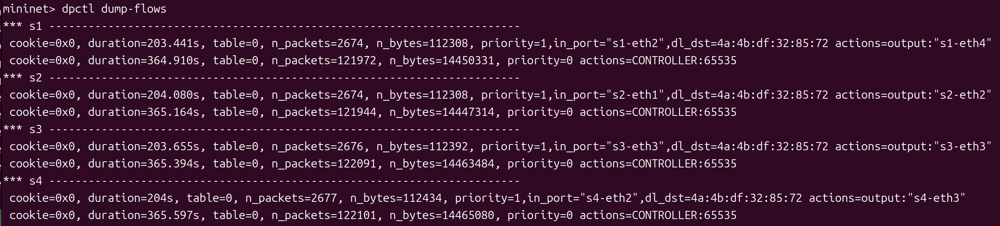
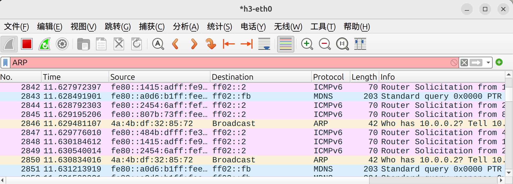
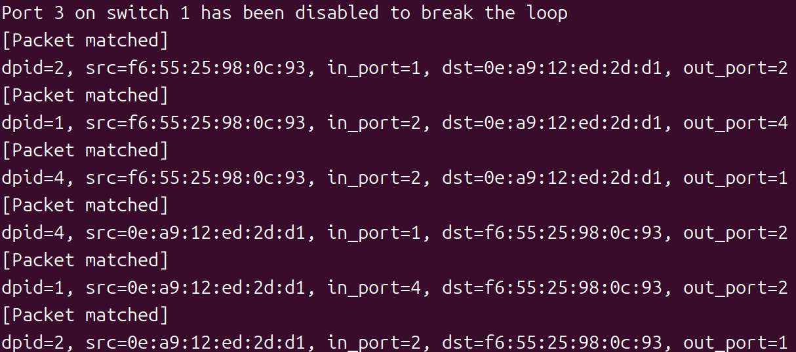
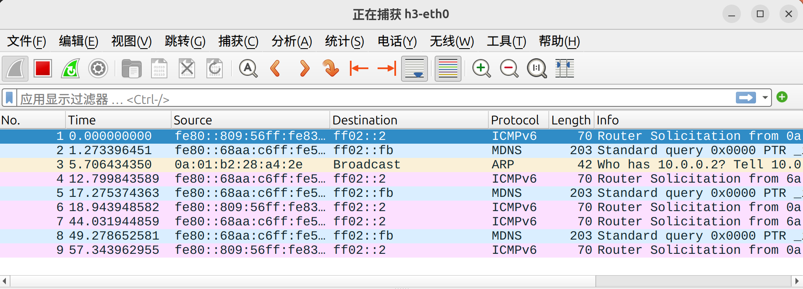
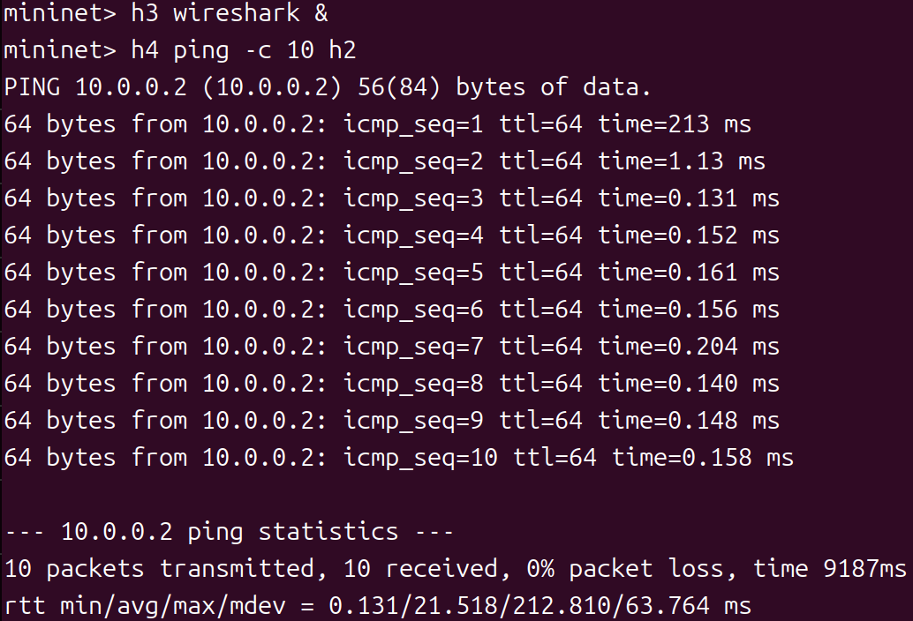
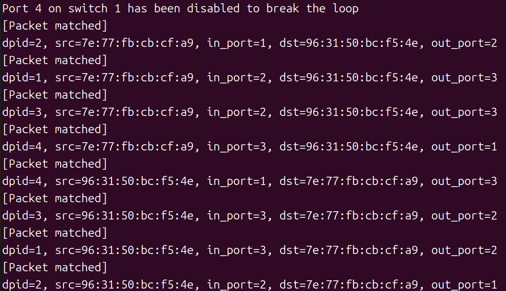
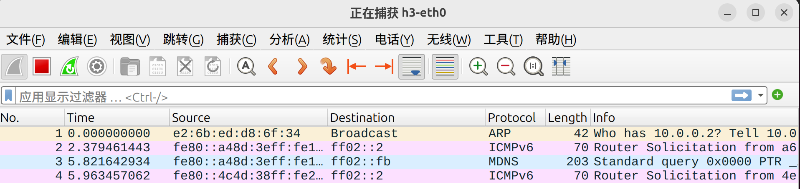

# Task2：禁用端口解决环路广播

## 任务目标

通过禁用交换机端口打破网络环路。

## 网络拓扑（./topo_2.py）

```
    h1 --- s1 --- s2 --- h2
          / \  
         /   \  
        s3---s4
        |     |
        h3   h4
```

- **4 个主机**：h1, h2, h3, h4
- **4 个交换机**：s1, s2, s3, s4
- **环路**：s1--s3--s4 

---

## 实验步骤

### 步骤 1：观察环路广播问题

**终端 1：启动控制器**
```bash
osken-manager self_learning_switch.py
```

**终端 2：启动网络拓扑**
```bash
sudo ./topo_2.py
```

**Mininet CLI 中：**
```bash
# 启动 Wireshark 抓包
mininet> h3 wireshark &

# 发送 ping 测试
mininet> h4 ping -c 3 h2

# 查看流表
mininet> dpctl dump-flows
```

**观察现象：**
- ~~*❌ h4 与h2 之间无法正常通信*~~

- ~~*❌ 观察流表`n_packets`参数，发现数百万个包*~~

- ~~*❌ h3收到大量重复的`ARP Request`包*~~


**清理环境：**
```bash
mininet> exit
$ sudo mn -c
```

### 步骤 2：判断交换机s1 与s3、s4 相连的端口号

**步骤 1中控制器输出如下：**
```bash
[Packet matched]
dpid=2, src=aa:38:95:87:f0:9f, in_port=1, dst=86:da:a1:6e:77:1c, out_port=2
[Packet matched]
dpid=1, src=aa:38:95:87:f0:9f, in_port=2, dst=86:da:a1:6e:77:1c, out_port=4
[Packet matched]
dpid=2, src=aa:38:95:87:f0:9f, in_port=1, dst=86:da:a1:6e:77:1c, out_port=2
[Packet matched]
dpid=4, src=aa:38:95:87:f0:9f, in_port=2, dst=86:da:a1:6e:77:1c, out_port=3
[Packet matched]
dpid=4, src=aa:38:95:87:f0:9f, in_port=2, dst=86:da:a1:6e:77:1c, out_port=3
[Packet matched]
dpid=4, src=aa:38:95:87:f0:9f, in_port=2, dst=86:da:a1:6e:77:1c, out_port=3
[Packet matched]
dpid=3, src=aa:38:95:87:f0:9f, in_port=3, dst=86:da:a1:6e:77:1c, out_port=2
[Packet matched]
dpid=3, src=aa:38:95:87:f0:9f, in_port=3, dst=86:da:a1:6e:77:1c, out_port=2
[Packet matched]
dpid=3, src=aa:38:95:87:f0:9f, in_port=3, dst=86:da:a1:6e:77:1c, out_port=2
[Packet matched]
dpid=3, src=aa:38:95:87:f0:9f, in_port=3, dst=86:da:a1:6e:77:1c, out_port=3
[Packet matched]
dpid=1, src=aa:38:95:87:f0:9f, in_port=3, dst=86:da:a1:6e:77:1c, out_port=4
[Packet matched]
dpid=1, src=aa:38:95:87:f0:9f, in_port=3, dst=86:da:a1:6e:77:1c, out_port=4
[Packet matched]
dpid=1, src=aa:38:95:87:f0:9f, in_port=3, dst=86:da:a1:6e:77:1c, out_port=4
```
观察可知：s1 与 s3 相连的端口号为 3，s1 与 s4 相连的端口号为 4。

### 步骤 3：修改控制器代码
**修改`loop_breaker_switch.py`**

- 禁用端口并确保学习和转发时跳过该端口
```python
class Switch_Dict(app_manager.OSKenApp):
    def __init__(self, *args, **kwargs):
        super(Switch_Dict, self).__init__(*args, **kwargs)
        # ......
        self.flag = 0 # only modify once
        self.blocked = {}  # {dpid: port_no}

def packet_in_handler(self, ev):
    msg = ev.msg
    dp = msg.datapath
    ofp = dp.ofproto
    parser = dp.ofproto_parser

    # the identity of switch
    dpid = dp.id
    # the port that receive the packet
    in_port = msg.match['in_port']
    pkt = packet.Packet(msg.data)
    eth_pkt = pkt.get_protocol(ethernet.ethernet)
    if eth_pkt.ethertype == ether_types.ETH_TYPE_LLDP:
        return
    if eth_pkt.ethertype == ether_types.ETH_TYPE_IPV6:
        return
    # get the mac
    dst = eth_pkt.dst
    src = eth_pkt.src
        
    # you need to code here to avoid broadcast loop to finish mission 2
    if dpid == 1 and self.flag == 0:
        # 禁用端口号
        target_port = 3
        port = dp.ports.get(target_port)
        # 构造 OFPPortMod 消息来禁用端口
        port_mod = parser.OFPPortMod(
            datapath=dp,
            port_no=target_port,
            hw_addr=port.hw_addr, 
            config=ofp.OFPPC_PORT_DOWN,   # 禁用端口
            mask=ofp.OFPPC_PORT_DOWN,     # 只修改 PORT_DOWN 标志
            advertise=0
        )
        dp.send_msg(port_mod)
        # 标记已修改，避免重复操作
        self.flag = 1
        self.blocked[dpid] = target_port
        self.logger.info("Port %s on switch %s has been disabled to break the loop", target_port, dpid)

    # self-learning
    # you need to code here to avoid the direct flooding
    # having fun
    # :)
    # just code in mission 1

    # 初始化该交换机的 MAC 表（如果还没有）
    self.mac_to_port.setdefault(dpid, {})
        
    # 如果这个包是从被禁用端口进来的，直接无视
    if dpid in self.blocked and in_port == self.blocked[dpid]:
        return

    # 学习源 MAC 地址和入端口的映射
    self.mac_to_port[dpid][src] = in_port
        
    # 查询目的 MAC 地址是否已学习
    if dst in self.mac_to_port[dpid]:
        # 映射表命中，获取输出端口
        out_port = self.mac_to_port[dpid][dst]
            
        # 如果目标端口正好是被禁用的，就当没学过，走洪泛逻辑
        if dpid in self.blocked and out_port == self.blocked[dpid]:
            actions = [parser.OFPActionOutput(ofp.OFPP_FLOOD)]
            out = parser.OFPPacketOut(
                datapath=dp,
                buffer_id=msg.buffer_id,
                in_port=in_port,
                actions=actions,
                data=msg.data
            )
            dp.send_msg(out)
                
        else: 
            # 打印五元组信息
            self.logger.info("[Packet matched]\ndpid=%s, src=%s, in_port=%s, dst=%s, out_port=%s", dpid, src, in_port, dst, out_port)
                
            # 构造匹配规则和动作
            match = parser.OFPMatch(in_port=in_port, eth_dst=dst)
            actions = [parser.OFPActionOutput(out_port)]
                
            # 下发流表（可以修改 hard_timeout 参数来观察不同效果）
            # hard_timeout=0 表示永久有效
            # hard_timeout=5 表示 5 秒后失效
            self.add_flow(dp, 1, match, actions, hard_timeout=0)
                
            # 转发当前数据包
            out = parser.OFPPacketOut(
                datapath=dp,
                buffer_id=msg.buffer_id,
                in_port=in_port,
                actions=actions,
                data=msg.data
            )
            dp.send_msg(out)
    else:
        # 映射表未命中，洪泛
        actions = [parser.OFPActionOutput(ofp.OFPP_FLOOD)]
        out = parser.OFPPacketOut(
            datapath=dp,
            buffer_id=msg.buffer_id,
            in_port=in_port,
            actions=actions,
            data=msg.data
        )
        dp.send_msg(out)
```

### 步骤 4：禁用端口3，验证环路已被打破

**终端 1：启动控制器**
```bash
osken-manager loop_breaker_switch.py
```

**终端 2：启动网络拓扑**
```bash
sudo ./topo_2.py
```

**Mininet CLI 中：**
```bash
# 启动 Wireshark 抓包
mininet> h3 wireshark &

# 发送 ping 测试
mininet> h4 ping -c 10 h2
```

**结果如下：**
- *✅ h4 与h2 之间通信正常*

- *✅ 控制台输出*

- *✅ h3只收到正常的 `ARP` 和 `ICMP` 包*


**清理环境：**
```bash
mininet> exit
$ sudo mn -c
```

### 步骤 5：禁用端口4，验证环路已被打破

**终端 1：启动控制器**
```bash
osken-manager loop_breaker_switch.py
```

**终端 2：启动网络拓扑**
```bash
sudo ./topo_2.py
```

**Mininet CLI 中：**
```bash
# 启动 Wireshark 抓包
mininet> h3 wireshark &

# 发送 ping 测试
mininet> h4 ping -c 10 h2
```

**结果如下：**
- *✅ h4 与h2 之间通信正常*

- *✅ 控制台输出*

- *✅ h3只收到正常的 `ARP` 和 `ICMP` 包*


**清理环境：**

```bash
mininet> exit
$ sudo mn -c
```