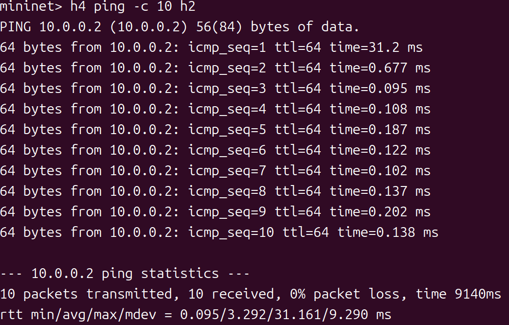
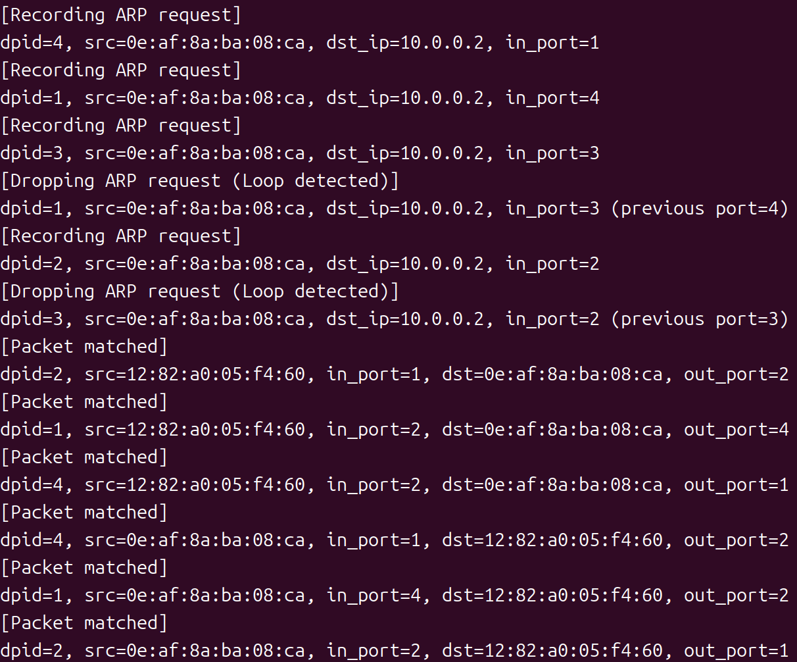

# Task3：转发历史信息解决环路广播

## 任务目标

通过记录 ARP Request 转发历史，检测并阻断环路。

## 网络拓扑（./topo_2.py）

```
    h1 --- s1 --- s2 --- h2
          / \  
         /   \  
        s3---s4
        |     |
        h3   h4
```

- **4 个主机**：h1, h2, h3, h4
- **4 个交换机**：s1, s2, s3, s4
- **环路**：s1--s3--s4 

---

## 实验步骤

### 步骤 1：loop_detecting_switch.py

```python
# 检测并防止 ARP 广播环路
if dst == ETHERNET_MULTICAST and ARP in header_list:
# you need to code here to avoid broadcast loop to finish mission 2
    arp_pkt = header_list[ARP]
    arp_dst_ip = arp_pkt.dst_ip
            
    # 构造映射键：(dpid, src_mac, dst_ip)
    key = (dpid, src, arp_dst_ip)
            
    # 检查是否已经记录过这个 ARP Request
    if key in self.sw:
        # 如果之前记录的端口与当前端口不同，说明产生了环路
        if self.sw[key] != in_port:
            self.logger.info("Loop detected! Dropping ARP request: dpid=%s, src=%s, dst_ip=%s, in_port=%s (previous port=%s)", dpid, src, arp_dst_ip, in_port, self.sw[key])
            # 不执行任何转发操作，直接返回
            return
        else:
            # 第一次收到这个 ARP Request，记录下来
            self.sw[key] = in_port
            self.logger.info("Recording ARP request: dpid=%s, src=%s, dst_ip=%s, in_port=%s", dpid, src, arp_dst_ip, in_port)
```

### 步骤 3： 验证环路广播被阻断

**终端 1：启动控制器**
```bash
osken-manager loop_detecting_switch.py
```

**终端 2：启动网络拓扑**
```bash
sudo ./topo_2.py
```

**Mininet CLI 中：**
```bash
# 发送 ping 测试
mininet> h4 ping -c 10 h2
```

**结果如下：**
- *✅ h4 与h2 之间通信正常*

- *✅ 控制台输出*


**日志分析：**
1. **第一次记录**：s4 从端口 1 收到 h4 发出的 ARP Request
2. **第二次记录**：s1 从端口 4 收到相同的 ARP Request
3. **第三次记录**：s3 从端口 3 收到相同的 ARP Request
4. **环路检测**：s1 再次从端口 3 收到相同的 ARP Request（说明环路）→ 丢弃！

**清理环境：**
```bash
mininet> exit
$ sudo mn -c
```

#### 步骤 3：环路判断逻辑说明

**核心思想：**
- 维护映射表 `sw`：`(dpid, src_mac, dst_ip) -> in_port`
- 如果同一个 `(dpid, src_mac, dst_ip)` 从不同端口收到 → 检测到环路 → 丢弃

**举例说明：**

h4 (MAC: `e6:71:b1:e3:2c:c9`, IP: `10.0.0.4`) 要 ping h2 (IP: `10.0.0.2`)：

1. **h4 发出 ARP Request**：询问谁有 `10.0.0.2`

2. **广播传播路径：**
   ```
   h4 → s4 → s1 (端口4) → s3 (环路)
              ↓
             s2 → h2 ✅
   ```
   
3. **环路检测：**
   - s1 第一次从端口 4 收到 → 记录 `(1, e6:71:b1:e3:2c:c9, 10.0.0.2) -> 4`
   - s1 经过环路后从端口 3 又收到同样的ARP → 检测到环路 → 丢弃！ 
   > 从两个不同端口收到相同的 ARP Request，说明相同的请求通过不同路径到达当前交换机。