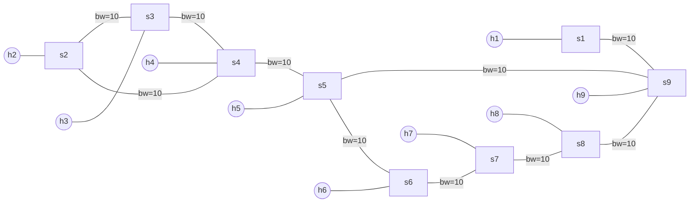
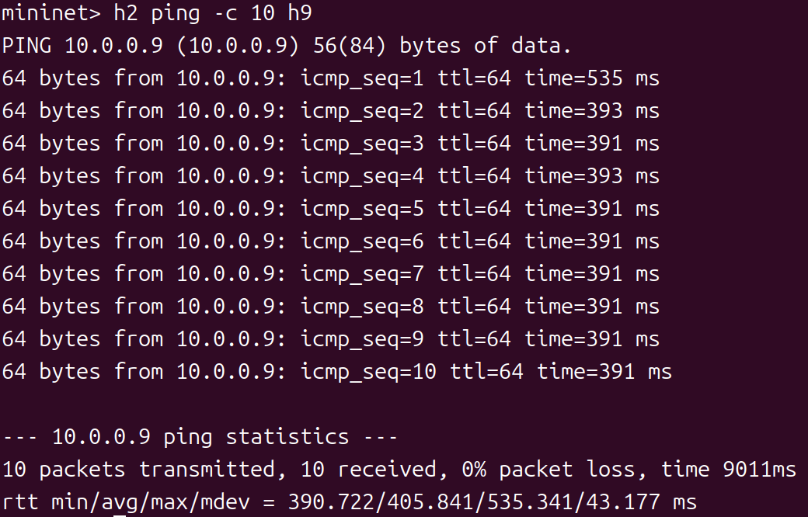
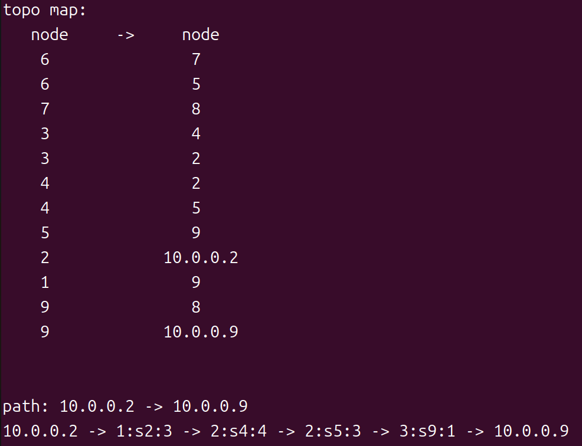

# Task1：最少跳数路径

## 环境准备

```bash
# 进入 lab3/ 目录
cd ~/桌面/lab3

# 一键设置环境（推荐）
source setup.sh

# 或者手动执行
uv sync
source .venv/bin/activate
```

## 添加执行权限

```bash
chmod +x topo.py
```

---

## 任务目标

理解 SDN 控制器如何通过 LLDP 获取网络拓扑，并使用 NetworkX 计算最少跳数路径。

## 网络拓扑（./topo.py）



- **9 个主机**：h1, h2, h3, h4, h5, h6, h7, h8, h9
- **9 个交换机**：s1, s2, s3, s4, s5, s6, s7, s8, s9

---

## 核心概念

### 1. 网络拓扑发现流程

```
步骤 1: LLDP 发现交换机间链路
  控制器 → S1 (发送 LLDP)
  S1 → S2 (转发 LLDP)
  S2 → 控制器 (PacketIn)
  控制器解析 → 记录 (S1, S2) 链路

步骤 2: 主机发现（沉默主机问题）
  主机首次通信 → ARP 广播
  控制器收到 PacketIn → 记录主机位置
  
步骤 3: 构建拓扑图
  使用 NetworkX Graph 存储拓扑
  节点: 主机 + 交换机
  边: 链路（带权重属性）
```

### 2. NetworkX 最短路径计算

```python
import networkx as nx

# 创建拓扑图
topo_map = nx.Graph()

# 添加边（hop=1 表示跳数权重）
topo_map.add_edge(src, dst, hop=1, is_host=False)

# 计算最短路径（基于 hop 权重）
paths = list(nx.shortest_simple_paths(topo_map, src, dst, weight='hop'))
shortest_path = paths[0]  # 第一条路径即为最短路径
```

**参数说明**：
- `src`: 源节点（IP 地址）
- `dst`: 目标节点（IP 地址）
- `weight`: 权重属性名称（'hop' 或 'delay'）
- 返回值: 路径列表，按成本从小到大排序

---

## 实验步骤

### 步骤 1：理解拓扑获取机制

阅读 `network_awareness.py` 中的 `_get_topology()` 方法：

```python
def _get_topology(self):
    while True:
        # 获取所有主机、交换机、链路
        hosts = get_all_host(self)
        switches = get_all_switch(self)
        links = get_all_link(self)
        
        # 添加主机到拓扑图
        for host in hosts:
            if host.ipv4:
                self.topo_map.add_edge(
                    host.ipv4[0], host.port.dpid, 
                    hop=1, delay=0, is_host=True)
        
        # 添加交换机链路到拓扑图
        for link in links:
            self.topo_map.add_edge(
                link.src.dpid, link.dst.dpid, 
                hop=1, is_host=False)
```

**关键数据结构**：
- `Host` 对象: 包含 `ipv4`, `port`, `mac` 等属性
- `Link` 对象: 包含 `src`, `dst` (PortData 对象)
- `Switch` 对象: 包含 `dp` (Datapath), `ports` 等属性

### 步骤 2：解决 ARP 环路问题

在 `least_hops.py` 的 `handle_arp()` 方法中实现环路检测：

```python
def handle_arp(self, msg, in_port, dst, src, pkt, pkt_type):
    """
    使用 (dpid, src_mac, dst_mac) -> in_port 的方法处理 ARP 环路
    """
    datapath = msg.datapath
    dpid = datapath.id
    parser = datapath.ofproto_parser
    ofproto = datapath.ofproto
    
    # 构造唯一键
    key = (dpid, src, dst)
    
    # 检测环路
    if key in self.sw:
        if self.sw[key] != in_port:
            # 环路！丢弃包
            self.logger.info(
                "ARP loop detected: dpid=%s, src=%s, dst=%s, "
                "in_port=%s (previous=%s)",
                dpid, src, dst, in_port, self.sw[key]
            )
            return  # 丢弃包
    else:
        # 首次记录
        self.sw[key] = in_port
    
    # 洪泛 ARP
    actions = [parser.OFPActionOutput(ofproto.OFPP_FLOOD)]
    out = parser.OFPPacketOut(
        datapath=datapath, 
        buffer_id=msg.buffer_id, 
        in_port=in_port, 
        actions=actions, 
        data=msg.data
    )
    datapath.send_msg(out)
```

### 步骤 3：验证最少跳数路径选择
**终端 1：启动控制器**
```bash
osken-manager least_hops.py --observe-links
```

**终端 2：启动网络拓扑**
```bash
sudo ./topo.py
```

**Mininet CLI 中：**
```bash
# 发送 ping 测试
mininet> h2 ping -c 10 h9
```

**结果如下：**
- *✅ h2 与h9 之间通信正常*

- *✅ 控制台输出*

```
path: 10.0.0.2 -> 10.0.0.9
10.0.0.2 -> 1:s2:2 -> 2:s4:4 -> 2:s5:3 -> 3:s9:1 -> 10.0.0.9
```
**分析：**
- 路径: h2 → s2 → s4 → s5 → s9 → h9
- 总跳数: 4 跳
- 前几次 ping 显示 "host not find/no path"（沉默主机现象）

**清理环境：**
```bash
mininet> exit
$ sudo mn -c
```