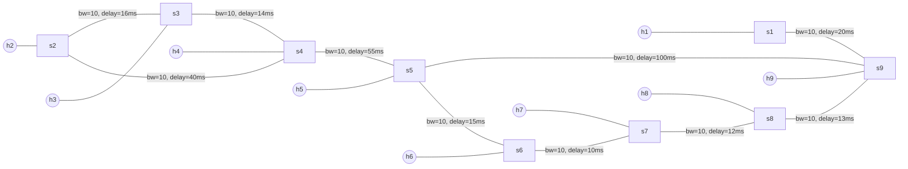
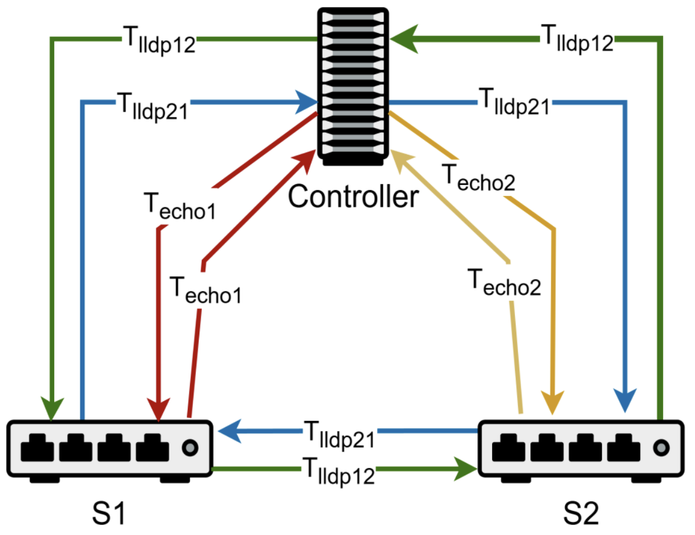
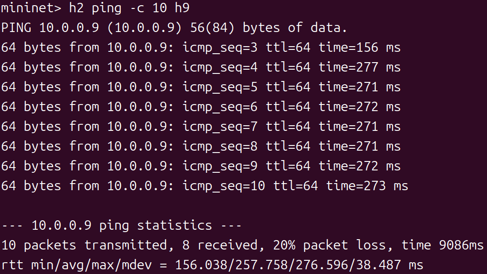
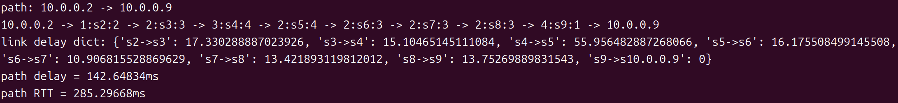
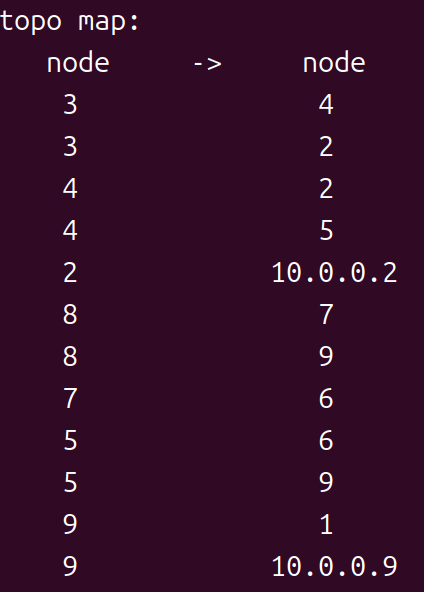
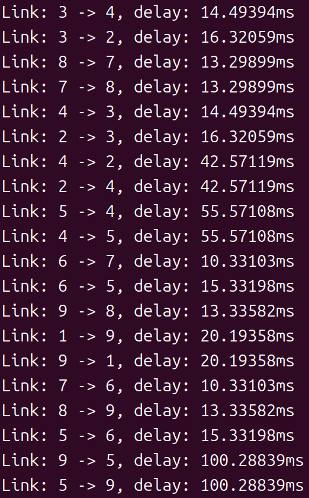

# Task2：最少时延路径

## 任务目标

通过 LLDP 和 Echo 消息测量链路时延，计算从 h2 到 h9 的最小时延路径，并用 Ping RTT 验证。

## 网络拓扑（./topo.py）



- **9 个主机**：h1, h2, h3, h4, h5, h6, h7, h8, h9
- **9 个交换机**：s1, s2, s3, s4, s5, s6, s7, s8, s9

---

## 时延测量原理

### *示意图*



> 使用 LLDP（链路层发现协议）和 Echo 消息测量链路时延。控制器发送 LLDP 包通过交换机链路传递，并测量往返时间。同时，控制器发送 Echo 消息测量与各交换机的往返时间。

### *公式*

对于链路 `(S1, S2)`，单向时延计算为：
$$
\text{delay} = \max\left(\frac{T_{\text{lldp12}} + T_{\text{lldp21}} - T_{\text{echo1}} - T_{\text{echo2}}}{2}, 0\right)
$$

其中：
- *T<sub>lldp12</sub>*: 控制器 → S1 → S2 → 控制器的往返时间（绿线）
- *T<sub>lldp21</sub>*: 控制器 → S2 → S1 → 控制器的往返时间（蓝线）
- *T<sub>echo1</sub>*: 控制器 ↔ S1 的往返时间（红线）
- *T<sub>echo2</sub>*: 控制器 ↔ S2 的往返时间（黄线）

---

## 实验步骤

### 步骤 1：修改代码支持 LLDP 时延测量

修改`.venv/lib/python3.13/site-packages/os_ken/topology/switches.py`

- `PortData`中，增加记录`LLDP`时延的变量 
```python
class PortData(object):
    def __init__(self, is_down, lldp_data):
        super(PortData, self).__init__()
        self.is_down = is_down
        self.lldp_data = lldp_data
        self.timestamp = None    # 新增：记录 LLDP 发送时间
        self.sent = 0
        self.delay = 0           # 新增：记录 T_lldp
```

- 在`lldp_packet_in_handler`中计算T<sub>lldp</sub>
```python
@set_ev_cls(ofp_event.EventOFPPacketIn, MAIN_DISPATCHER)
def lldp_packet_in_handler(self, ev):
    # ========== 新增开始 ==========
    recv_timestamp = time.time()  # 记录接收时间
    # ========== 新增结束 ==========
    
    if not self.link_discovery:
        return
    
    msg = ev.msg
    try:
        src_dpid, src_port_no = LLDPPacket.lldp_parse(msg.data)
    except LLDPPacket.LLDPUnknownFormat:
        return
    
    # ========== 新增开始 ==========
    # 计算 LLDP 时延并保存到 port_data
    for port, port_data in self.ports.items():
        if src_dpid == port.dpid and src_port_no == port.port_no:
            send_timestamp = port_data.timestamp
            if send_timestamp:
                port_data.delay = recv_timestamp - send_timestamp
    # ========== 新增结束 ==========
    
    # ... 原有代码 ...
```

修改`network_awareness.py`

- 给`NetworkAwareness`类加`LLDP`延迟表和`switches`实例
```python
def __init__(self, *args, **kwargs):
    super(NetworkAwareness, self).__init__(*args, **kwargs)
    # ... 原有代码 ...
    
    # ========== 新增数据结构 ==========
    self.lldp_delay_table = {}    # (src_dpid, dst_dpid) -> T_lldp
    self.switches = {}            # switches 实例
```

- 在`NetworkAwareness`类中添加`function：packet_in_hander`，用于处理`LLDP`消息
```python
from os_ken.base.app_manager import lookup_service_brick
from os_ken.topology.switches import LLDPPacket

@set_ev_cls(ofp_event.EventOFPPacketIn, MAIN_DISPATCHER)
def packet_in_handler(self, ev):
    """处理 LLDP 消息，获取 LLDP 时延"""
    msg = ev.msg
    dpid = msg.datapath.id
    
    try:
        src_dpid, src_port_no = LLDPPacket.lldp_parse(msg.data)
        
        # 获取 switches 实例（只需获取一次）
        if not self.switches:
            self.switches = lookup_service_brick('switches')
        
        # 从 switches 中获取 LLDP 时延
        for port in self.switches.ports.keys():
            if src_dpid == port.dpid and src_port_no == port.port_no:
                # 保存 T_lldp
                self.lldp_delay_table[(src_dpid, dpid)] = \
                    self.switches.ports[port].delay
                break
    except:
        return
```

### 步骤2：周期发送Echo，记录控制器↔交换机的RTT

修改`network_awareness.py`

- 增加数据结构：
  - `echo_RTT_table`，用于记录 Echo RTT 
  - `echo_send_timestamp`，用于记录Echo的发送时间 
```python
def __init__(self, *args, **kwargs):
    super(NetworkAwareness, self).__init__(*args, **kwargs)
    # ... 原有代码 ...
    
    # ========== 新增数据结构 ==========
    self.echo_RTT_table = {}       # dpid -> T_echo
    self.echo_send_timestamp = {}  # dpid -> send_time
```

- 实现`function：send_echo_request`
  - 构造`OFPEchoRequest`消息并发送 
  - 记录`send_time`并存入`echo_send_timestamp[dpid]`
```python
def send_echo_request(self, switch):
    """向交换机发送 Echo 请求"""
    datapath = switch.dp
    parser = datapath.ofproto_parser
    dpid = datapath.id
    
    # 记录发送时间
    send_time = time.time()
    self.echo_send_timestamp[dpid] = send_time
    
    # 构造 Echo 请求（data 必须是 bytes 类型）
    data = str(send_time).encode('utf-8')
    echo_req = parser.OFPEchoRequest(datapath, data=data)
    
    # 发送
    datapath.send_msg(echo_req)
```

- 处理`Echo`回复，计算T<sub>echo</sub>
  - 编写处理`echo`包的函数`echo_reply_handler`
  - 将`echo_reply_handler`与事件`EventOFPEchoReply`进行绑定
```python
@set_ev_cls(ofp_event.EventOFPEchoReply, MAIN_DISPATCHER)
def handle_echo_reply(self, ev):
    """处理 Echo 回复，计算 T_echo"""
    try:
        msg = ev.msg
        datapath = msg.datapath
        dpid = datapath.id
        
        # 记录接收时间
        recv_time = time.time()
        
        # 获取发送时间（可选：从 data 中解码验证）
        send_time = self.echo_send_timestamp.get(dpid)
        if send_time:
            # 计算 Echo RTT
            self.echo_RTT_table[dpid] = recv_time - send_time
    except Exception as e:
        self.logger.warning(f"Failed to handle echo reply: {e}")
```

- 周期性向每个交换机发送`Echo`
```python
def examine_echo_RTT(self):
    """周期性测量 Echo RTT"""
    while True:
        # 获取所有交换机
        switches = get_all_switch(self)
        
        # 向每个交换机发送 Echo
        for switch in switches:
            self.send_echo_request(switch)
        
        # 睡眠（使用 hub.sleep 减少影响）
        hub.sleep(SEND_ECHO_REQUEST_INTERVAL)

# 在 __init__ 中启动线程
def __init__(self, *args, **kwargs):
    # ... 原有代码 ...
    
    # 启动 Echo 测量线程
    self.echo_thread = hub.spawn(self.examine_echo_RTT)
```

### 步骤3：计算链路时延并更新拓扑图权重

修改`network_awareness.py`

- 在`NetworkAwareness`中添加字典`link_delay_table`，用于存储链路时延
```python
def __init__(self, *args, **kwargs):
    super(NetworkAwareness, self).__init__(*args, **kwargs)
    # ... 原有代码 ...
    
    # ========== 新增数据结构 ==========
    self.link_delay_table = {}     # (dpid1, dpid2) -> delay
```

- 计算链路时延
```python
def calculate_link_delay(self, src_dpid, dst_dpid):
    """
    计算链路单向时延
    公式: delay = max((T_lldp12 + T_lldp21 - T_echo1 - T_echo2) / 2, 0)
    """
    try:
        # 获取 LLDP 往返时延
        lldp_12 = self.lldp_delay_table.get((src_dpid, dst_dpid), 0)
        lldp_21 = self.lldp_delay_table.get((dst_dpid, src_dpid), 0)
        
        # 获取 Echo RTT
        echo_1 = self.echo_RTT_table.get(src_dpid, 0)
        echo_2 = self.echo_RTT_table.get(dst_dpid, 0)

        # 计算链路时延
        delay = max((lldp_12 + lldp_21 - echo_1 - echo_2) / 2, 0.0)
        
        # 双向写缓存，后续可回退
        self.link_delay_table[(src_dpid, dst_dpid)] = delay
        self.link_delay_table[(dst_dpid, src_dpid)] = delay

        return delay

    except KeyError:
        # 链路发现和延迟计算是异步的，可能出现键不存在的情况
        return self.link_delay_table.get((src_dpid, dst_dpid), float('inf'))
```

- 更新topo
  - 修改`_get_topology()`，使其能够计算`delay`并添加至`edge`的属性中
```python
for link in links:
    # ... 原有代码 ...
    
    # ========== 新增：计算链路时延 ==========
    delay = self.calculate_link_delay(link.src.dpid, link.dst.dpid)
    
    # 输出链路时延信息
    self.logger.info(
        "Link: %s -> %s, delay: %.5fms",
        link.src.dpid, link.dst.dpid, delay * 1000
    )
    
    # 添加边到拓扑图（包含 delay 属性）
    self.topo_map.add_edge(
        link.src.dpid, link.dst.dpid, 
        hop=1, 
        delay=delay,  # 新增 delay 属性
        is_host=False
    )
```

### 步骤4：实现最小时延路径控制器：ShortestDelay 

修改`shortest_delay.py`

- 修改`weight`为`delay`
```python
class ShortestDelay(app_manager.OSKenApp):
    def __init__(self, *args, **kwargs):
        super(ShortestDelay, self).__init__(*args, **kwargs)
        self.network_awareness = kwargs['network_awareness']
        self.weight = 'delay'  # ⚠️ 改为 'delay'
        self.mac_to_port = {}
        self.sw = {}
        self.path = None
```

- 在`handle_ipv4`中计算路径时延
```python
def handle_ipv4(self, msg, src_ip, dst_ip, pkt_type):
    # ... 原有代码 ...
    
    # ========== 新增：计算路径时延 ==========
    # 构建链路时延字典
    link_delay_dict = {}
    path_delay = 0.0
    
    for i in range(1, len(dpid_path) - 1):
        src = dpid_path[i]
        dst = dpid_path[i + 1]
        
        # 从拓扑图中获取时延
        if self.network_awareness.topo_map.has_edge(src, dst):
            delay = self.network_awareness.topo_map[src][dst].get('delay', 0)
            link_delay_dict[f"s{src}->s{dst}"] = delay * 1000  # 转换为 ms
            path_delay += delay
    
    # 计算 Path RTT（往返时间 = 2 * 单向时延）
    path_RTT = path_delay * 2
    
    # 输出结果
    self.logger.info('link delay dict: %s', link_delay_dict)
    self.logger.info("path delay = %.5fms", path_delay * 1000)
    self.logger.info("path RTT = %.5fms", path_RTT * 1000)
    
    # ... 下发流表 ...
```

- 在`handle_arp`中实现ARP环路检测（同`least_hops.py`）
```python
def handle_arp(self, msg, in_port, dst,src, pkt,pkt_type):
    """
    使用 (dpid, src_mac, dst_mac) -> in_port 的方法处理 ARP 环路
    """
    datapath = msg.datapath
    dpid = datapath.id
    parser = datapath.ofproto_parser
    ofproto = datapath.ofproto
        
    # 构造唯一键
    key = (dpid, src, dst)
        
    # 检测环路
    if key in self.sw:
        if self.sw[key] != in_port:
            # 环路！丢弃包
            self.logger.info(
                "[ARP loop detected]\ndpid=%s, src=%s, dst=%s, "
                "in_port=%s (previous=%s)",
                dpid, src, dst, in_port, self.sw[key]
            )
            return  # 丢弃包
    else:
        # 首次记录
        self.sw[key] = in_port
        
    # 洪泛 ARP
    actions = [parser.OFPActionOutput(ofproto.OFPP_FLOOD)]
    out = parser.OFPPacketOut(
        datapath=datapath, 
        buffer_id=msg.buffer_id, 
        in_port=in_port, 
        actions=actions, 
        data=msg.data
    )
    datapath.send_msg(out)
```

### 步骤5：验证最小时延路径
**终端 1：启动控制器**
```bash
osken-manager shortest_delay.py --observe-links
```

**终端 2：启动网络拓扑**
```bash
sudo ./topo.py
```

**Mininet CLI 中：**
```bash
# 发送 ping 测试
mininet> h2 ping -c 10 h9
```

**结果如下：**
- *✅ h2 与h9 之间通信正常*

- *✅ 最小时延及路径*


- *✅ 控制器发现的网络拓扑*


- *✅ 各交换机链路的单向时延*


**分析：**
```
path: 10.0.0.2 -> 10.0.0.9
10.0.0.2 -> 1:s2:2 -> 2:s3:3 -> 3:s4:4 -> 2:s5:4 -> 2:s6:3 -> 2:s7:3 -> 2:s8:3 -> 4:s9:1 -> 10.0.0.9
link delay dict: {'s2->s3': 17.330288887023926, 's3->s4': 15.10465145111084, 's4->s5': 55.956482887268066, 's5->s6': 16.175508499145508, 's6->s7': 10.906815528869629, 's7->s8': 13.421893119812012, 's8->s9': 13.75269889831543, 's9->s10.0.0.9': 0}
path delay = 142.64834ms
path RTT = 285.29668ms
```
- 路径: h2 → s2 → s3 → s4 → s5 → s6 → s7 → s8 → s9 → h9
- 总跳数: 8 跳
- 前几次 ping 显示 "host not find/no path"（沉默主机现象）

**清理环境：**
```bash
mininet> exit
$ sudo mn -c
```