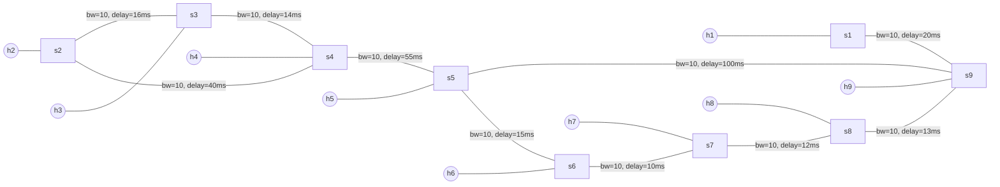
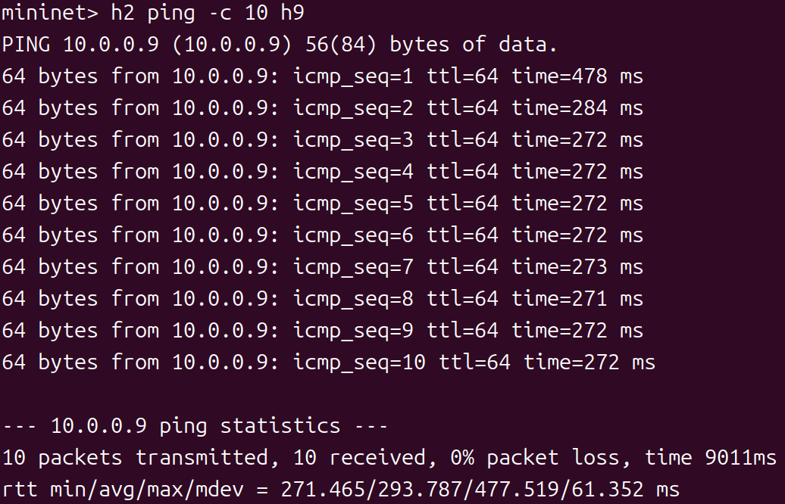
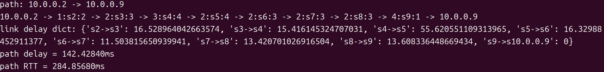
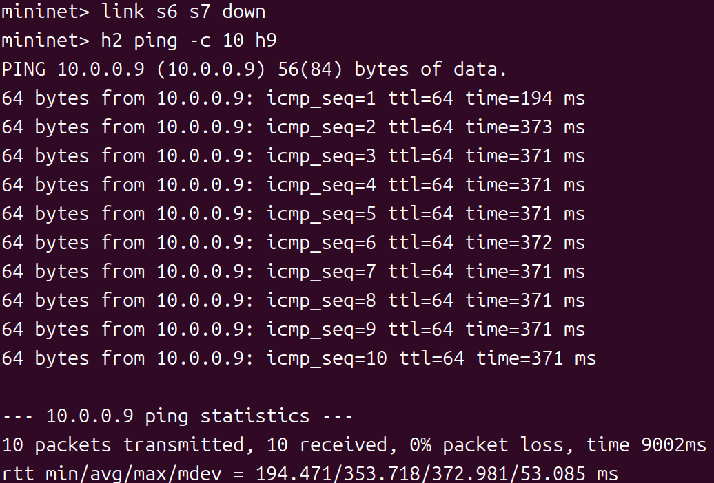
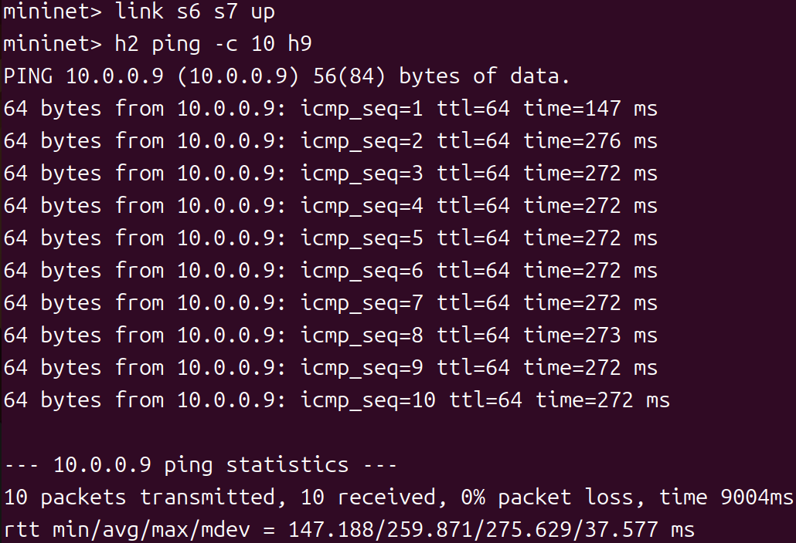
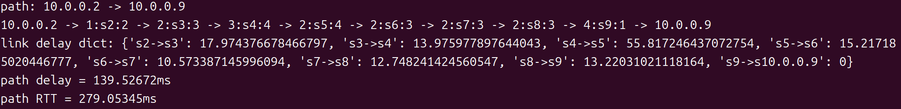

# Task3：容忍链路故障

## 任务目标

在链路故障或恢复时，控制器能自动检测并重新选择最优路径，保证通信不中断。

## 网络拓扑（./topo.py）



- **9 个主机**：h1, h2, h3, h4, h5, h6, h7, h8, h9
- **9 个交换机**：s1, s2, s3, s4, s5, s6, s7, s8, s9

---

## 故障恢复原理
当链路状态发生变化时，`OpenFlow`交换机会触发`EventOFPPortStatus`事件：
```python
@set_ev_cls(ofp_event.EventOFPPortStatus, MAIN_DISPATCHER)
def port_status_handler(self, ev):
    msg = ev.msg
    reason = msg.reason
    
    # reason 类型：
    # - OFPPR_ADD: 端口新增
    # - OFPPR_MODIFY: 端口修改（link up/down）
    # - OFPPR_DELETE: 端口删除
```
故障恢复流程
```
步骤 1: 链路故障 (link s6 s7 down)
  → 触发 EventOFPPortStatus
  → reason = OFPPR_MODIFY

步骤 2: 清理旧数据
  → 清空拓扑图 (topo_map.clear())
  → 删除所有流表
  → 清空 sw、mac_to_port

步骤 3: 重新发现拓扑
  → LLDP 自动重新发现
  → 构建新的拓扑图

步骤 4: 自动路径切换
  → 交换机无流表 → PacketIn
  → 控制器重新计算最优路径
  → 下发新流表
```

---

## 实验步骤

### 步骤 1：在`shortest_path.py`中实现链路故障检测与恢复逻辑
```python
# 1) 确保有一个装 table-miss 的工具函数
def install_table_miss(self, datapath):
    ofp = datapath.ofproto
    parser = datapath.ofproto_parser
    # priority 0, match any -> send to controller
    match = parser.OFPMatch()
    actions = [parser.OFPActionOutput(ofp.OFPP_CONTROLLER, ofp.OFPCML_NO_BUFFER)]
    inst = [parser.OFPInstructionActions(ofp.OFPIT_APPLY_ACTIONS, actions)]
    mod = parser.OFPFlowMod(
        datapath=datapath,
        priority=0,
        table_id=ofp.OFPTT_ALL if hasattr(ofp, "OFPTT_ALL") else 0,
        command=ofp.OFPFC_ADD,
        match=match,
        instructions=inst,
    )
    datapath.send_msg(mod)

# 2) 在交换机首次连接时装一次 table-miss
@set_ev_cls(ofp_event.EventOFPSwitchFeatures, CONFIG_DISPATCHER)
def switch_features_handler(self, ev):
    datapath = ev.msg.datapath
    self.install_table_miss(datapath)

# 3) 删“与端口相关”的流（in_port 与 out_port 两类），并确保删所有表；最后发 barrier
def delete_flow(self, datapath, port_no):
    ofp = datapath.ofproto
    parser = datapath.ofproto_parser
    try:
        # a) 删除匹配 in_port=port_no 的流（所有表）
        match_in = parser.OFPMatch(in_port=port_no)
        mod_in = parser.OFPFlowMod(
            datapath=datapath,
            table_id=ofp.OFPTT_ALL,
            command=ofp.OFPFC_DELETE,
            out_port=ofp.OFPP_ANY,
            out_group=ofp.OFPG_ANY,
            match=match_in
        )
        datapath.send_msg(mod_in)

        # b) 删除“动作输出到 port_no”的流：指定 out_port=port_no，match 置空
        match_any = parser.OFPMatch()
        mod_out = parser.OFPFlowMod(
            datapath=datapath,
            table_id=ofp.OFPTT_ALL,
            command=ofp.OFPFC_DELETE,
            out_port=port_no,
            out_group=ofp.OFPG_ANY,
            match=match_any
        )
        datapath.send_msg(mod_out)

        # c) 发 barrier，让删除顺序生效
        datapath.send_msg(parser.OFPBarrierRequest(datapath))

        self.logger.info("Cleared flows touching s%s port %s", datapath.id, port_no)

    except Exception as e:
            self.logger.error("Failed to delete flows on s%s p%s: %s", 
                                datapath.id, port_no, e)

# 4) 遍历所有交换机所有端口删流；删完立刻“重装 table-miss”
def delete_all_flow(self):
    switches = get_all_switch(self)  # 关键：传 self
    for sw in switches:
        dp = sw.dp
        for p in sw.ports:
            port_no = p.port_no
            if port_no == dp.ofproto.OFPP_LOCAL:
                continue
            self.delete_flow(dp, port_no)
        # 删完该交换机上的流，马上重装 table-miss，保证后续 packet_in 不丢
        self.install_table_miss(dp)

# 5) 端口状态事件：清缓存 + 删流（会重装 table-miss）
@set_ev_cls(ofp_event.EventOFPPortStatus, MAIN_DISPATCHER)
def port_status_handler(self, ev):
    msg = ev.msg
    dp = msg.datapath
    ofp = dp.ofproto
    reason = msg.reason

    # 记录一下
    try:
        pno = msg.desc.port_no
        self.logger.info("[PortStatus] s%s p%s reason=%s state=0x%x",
                            dp.id, pno, reason, msg.desc.state)
    except Exception:
        self.logger.info("[PortStatus] s%s reason=%s", dp.id, reason)

    if reason in (ofp.OFPPR_ADD, ofp.OFPPR_MODIFY, ofp.OFPPR_DELETE):
        # 1) 清空拓扑与学习表
        if hasattr(self, "network_awareness"):
            na = self.network_awareness
            if hasattr(na, "topo_map"):
                na.topo_map.clear()

        if hasattr(self, "sw"): self.sw.clear()
        if hasattr(self, "mac_to_port"): self.mac_to_port.clear()

        # 2) 删所有交换机相关流（函数里会为每台交换机重装 table-miss）
        self.delete_all_flow()

        self.logger.info("Topology/learned tables cleared and flows wiped; table-miss reinstalled.")
```

### 步骤5：验证链路故障与恢复
**终端 1：启动控制器**
```bash
osken-manager shortest_delay.py --observe-links
```

**终端 2：启动网络拓扑**
```bash
sudo ./topo.py
```

**Mininet CLI 中：**
```bash
# 发送 ping 测试
mininet> h2 ping -c 10 h9

# 模拟链路故障
mininet> link s6 s7 down
mininet> h2 ping -c 10 h9

# 恢复链路
mininet> link s6 s7 up
mininet> h2 ping -c 10 h9
```

**结果如下：**
- *✅ 初始状态(RTT≈270ms)*
     

    
- *✅ 链路故障后(RTT≈370ms)*
    

    
- *✅ 链路恢复后(RTT≈270ms)*
    

    

**分析：**
- 初始路径: h2 → s2 → s3 → s4 → s5 → s6 → s7 → s8 → s9 → h9
- 故障路径: h2 → s2 → s3 → s4 → s5 → s9 → h9
- 恢复路径: h2 → s2 → s3 → s4 → s5 → s6 → s7 → s8 → s9 → h9

**清理环境：**
```bash
mininet> exit
$ sudo mn -c
```